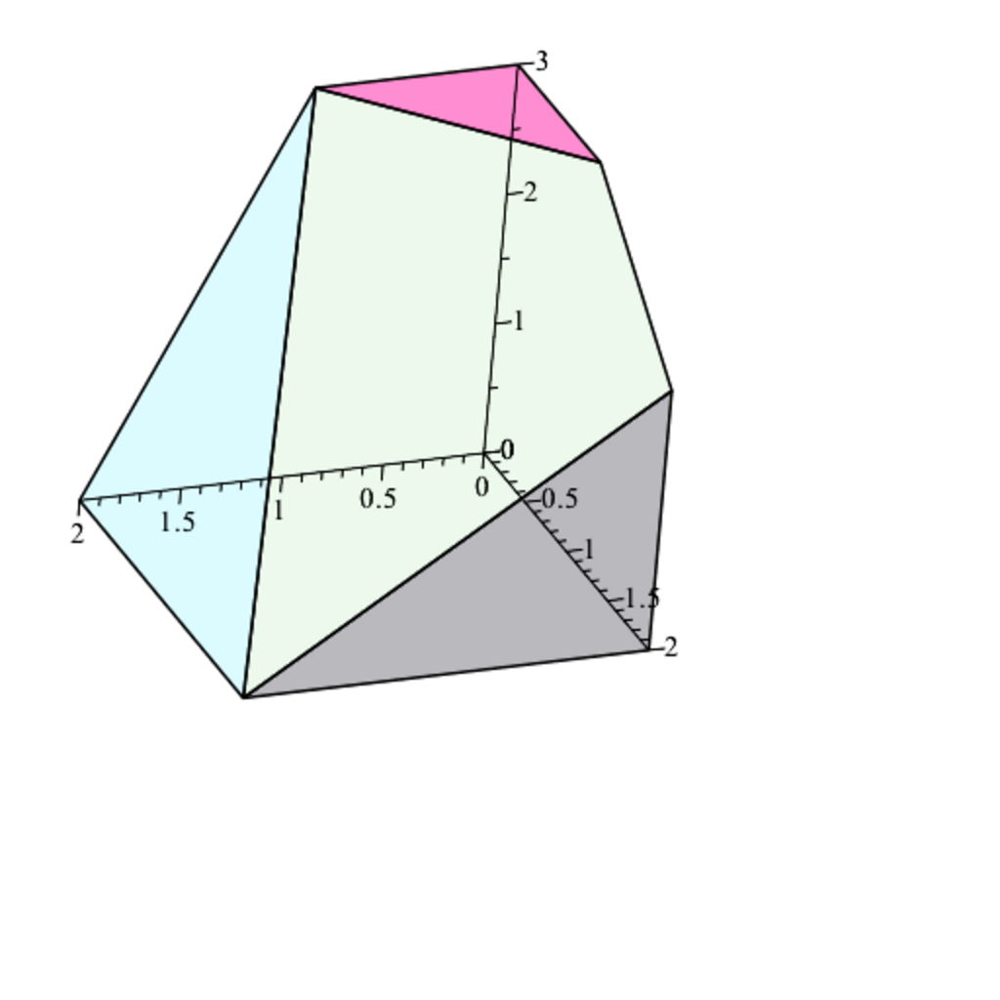

- **The Simplex Algorithm**
  - **The Idea Behind the Simplex Algorithm**
    - The simplex algorithm handles linear programs in standard form with constraints Ax = b and x ≥ 0, using basic feasible solutions corresponding to vertices of the polyhedron.
    - Degenerate basic feasible solutions have fewer than m positive components and can cause cycling, an infinite loop within the algorithm.
    - Pivoting steps replace basis vectors to move from one vertex to an adjacent vertex with a better objective function value.
    - Illustrative examples show how the simplex algorithm traverses vertices and optimizes or detects unboundedness.
    - For deeper exploration, see [Chvatal, Linear Programming](https://press.princeton.edu/books/hardcover/9780691046990/linear-programming).
  - **The Simplex Algorithm in General**
    - Each iteration updates the basis by pivoting, swapping one basis of size m with another vector to improve the objective function.
    - Cases are classified as (A) optimal solution found, (B1) unbounded, (B2) feasible improvement, and (B3) degeneracy with no improvement.
    - Pivot rules, such as Bland’s rule, prevent cycling and guarantee termination.
    - Phase I of the simplex algorithm finds an initial feasible solution, or proves infeasibility, while Phase II solves the original problem.
    - Key references include [Papadimitriou & Steiglitz, Combinatorial Optimization](https://press.princeton.edu/books/hardcover/9780691042589/combinatorial-optimization).
  - **How to Perform a Pivoting Step Efficiently**
    - The pivot step solves linear systems to find coefficients expressing nonbasic columns in terms of the basis matrix and updates the inverse basis matrix efficiently.
    - Eta matrices represent elementary transformations for updating bases, allowing efficient iterative inversion or system-solving.
    - Matrices and vectors required for iterations (basis inverse, reduced costs) are updated with low computational cost using these factorizations.
    - This methodology underlies the revised simplex method, standard in practical optimization software.
    - For full details, refer to [Chvatal, Linear Programming, Chapter 7](https://press.princeton.edu/books/hardcover/9780691046990/linear-programming).
  - **The Simplex Algorithm Using Tableaux**
    - The tableau organizes basic solution, reduced costs, and coefficients into a matrix updated via elementary row operations.
    - Each pivot corresponds to elementary row operations mimicking row reduction, including normalizing the pivot element and eliminating its column.
    - Proposition 46.2 describes the formula to update reduced costs via pivoting using matrix rows.
    - Example calculations illustrate the stepwise tableau updates until optimality is achieved.
    - Background reading: [Bertsimas & Tsitsiklis, Introduction to Linear Optimization](https://mitpress.mit.edu/books/introduction-linear-optimization).
  - **Computational Efficiency of the Simplex Method**
    - Empirically, the simplex method typically requires at most 3m iterations for problems of moderate size.
    - The Klee–Minty example shows worst-case exponential iteration count with certain pivot rules.
    - It remains an open question whether a polynomial-time pivot rule exists for the simplex algorithm.
    - The Hirsch conjecture posits linear step bounds in dimension, with known best bounds being quasipolynomial.
    - For further discussion, see [Matousek & Gardner, Understanding and Using Linear Programming](https://www.springer.com/gp/book/9783030111910).
