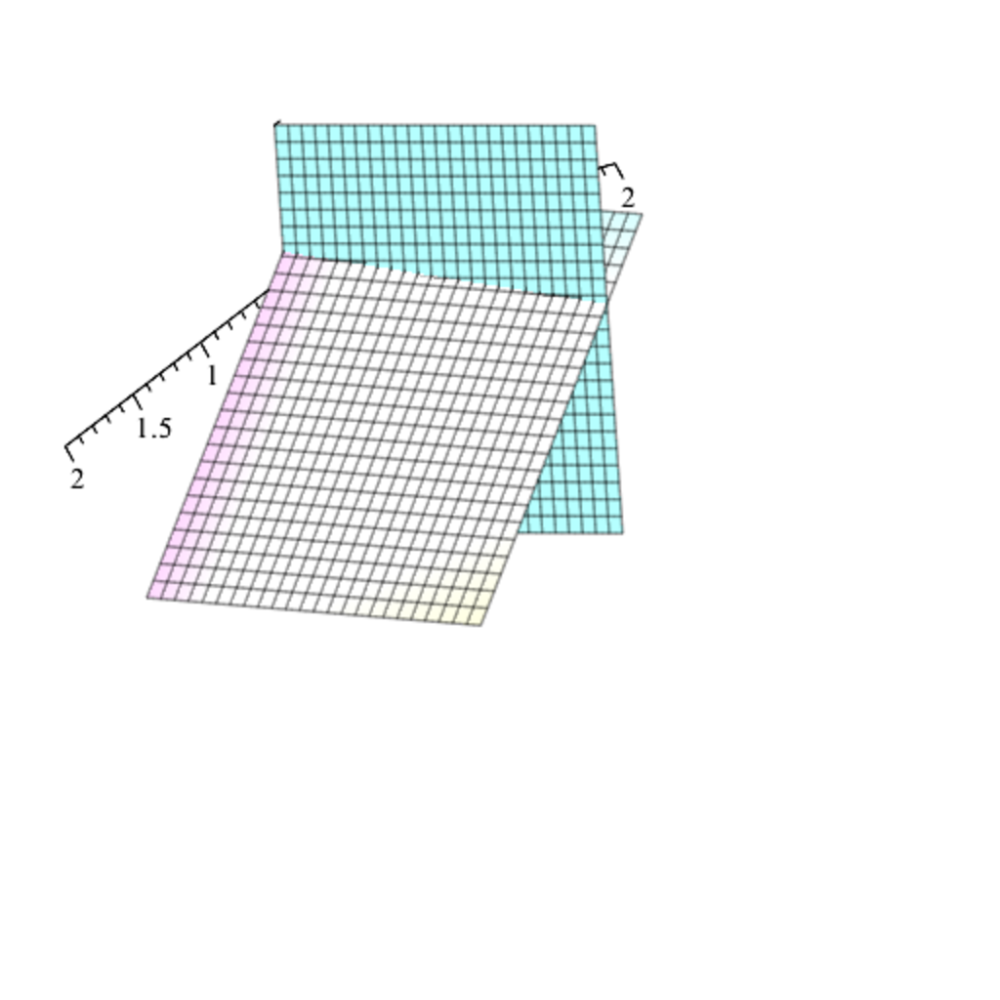

- **47.1 Variants of the Farkas Lemma**
  - The Farkas–Minkowski proposition provides a fundamental separation lemma for polyhedral cones in \(\mathbb{R}^n\).
  - The lemma states that if a vector \(b\) lies outside a polyhedral cone generated by vectors \(a_1, \ldots, a_n\), there exists a linear form \(y\) separating \(b\) and the cone.
  - Farkas Lemma Version I characterizes solvability of \(Ax = b\), \(x \geq 0\) via the existence of a linear form \(y\) with \(yA \geq 0\) and \(yb < 0\).
  - Farkas Lemma Version II extends this to systems \(Ax \leq b\), \(x \geq 0\), introducing nonnegative \(y\) satisfying \(yA \geq 0\), \(yb < 0\).
  - Alternative proofs involve distance functions to closed sets and geometric separation theorems.
  - For further study see [Linear Algebra and Geometry](https://example.org).

- **47.2 The Duality Theorem in Linear Programming**
  - The dual problem (D) minimizes \(yb\) under constraints \(yA \geq c\), \(y \geq 0\), dual to the primal maximization of \(cx\) subject to \(Ax \leq b\), \(x \geq 0\).
  - Weak duality states \(cx \leq yb\) for any feasible \(x, y\).
  - Strong duality asserts no duality gap when both primal and dual are feasible and bounded, i.e., optimal values coincide.
  - The simplex algorithm can produce optimal dual solutions alongside primal solutions.
  - The theorem classifies all linear programs into four cases of feasibility and boundedness.
  - See [Introduction to Linear Optimization](https://example.org) for deeper insights.

- **47.3 Complementary Slackness Conditions**
  - Complementary slackness conditions characterize optimality by requiring zero dual variables where primal constraints slack and zero primal variables where dual constraints slack.
  - Conditions \((\ast D)\) and \((\ast P)\) relate primal and dual feasibility to complementary zero product relations.
  - These conditions enable primal-dual methods that solve the primal problem using dual feasibility and vice versa.
  - The theorem forms the foundation for algorithms exploiting duality in optimization.
  - Refer to [Convex Optimization](https://example.org) for applications of slackness conditions.

- **47.4 Duality for Linear Programs in Standard Form**
  - Converts equality constraints \(Ax = b\) into paired inequalities to derive the dual problem.
  - The dual of the standard form primal requires arbitrary linear forms \(y\) satisfying \(yA \geq c\) without nonnegativity constraints.
  - The simplex method's optimal tableau yields dual optimal solutions using reduced costs.
  - Complementary slackness in standard form simplifies to conditions solely on primal variables \(x_j\).
  - This section deepens understanding of duality symmetry in optimization.
  - For further reading, consult [Linear Programming and Network Flows](https://example.org).

- **47.5 The Dual Simplex Algorithm**
  - The method finds optimal solutions when primal feasibility is not given but dual feasibility holds.
  - It iteratively adjusts basic solutions, pivoting to correct negative primal variables while maintaining dual feasibility.
  - The algorithm uses reduced costs and pivot rules analogous to the primal simplex to ensure progression and prevent cycling.
  - The dual simplex corresponds exactly to the simplex applied to the dual problem.
  - A detailed worked example illustrates the algorithm mechanics.
  - Study [Theory of Linear and Integer Programming](https://example.org) for algorithmic proofs and variations.

- **47.6 The Primal-Dual Algorithm**
  - Assumes nonnegative right-hand side \(b \geq 0\) by sign adjustments.
  - Uses feasible dual solutions \(y\) to guide the search for optimal primal solutions \(x\).
  - Exploits the complementary slackness equalities to identify active primal variables \(J\) satisfying \(y A_j = c_j\).
  - Forms the basis for efficient primal-dual iterative solution methods.
  - This approach bridges dual feasibility with primal optimality conditions.
  - For methodology, see [Primal-Dual Interior Point Methods](https://example.org).
