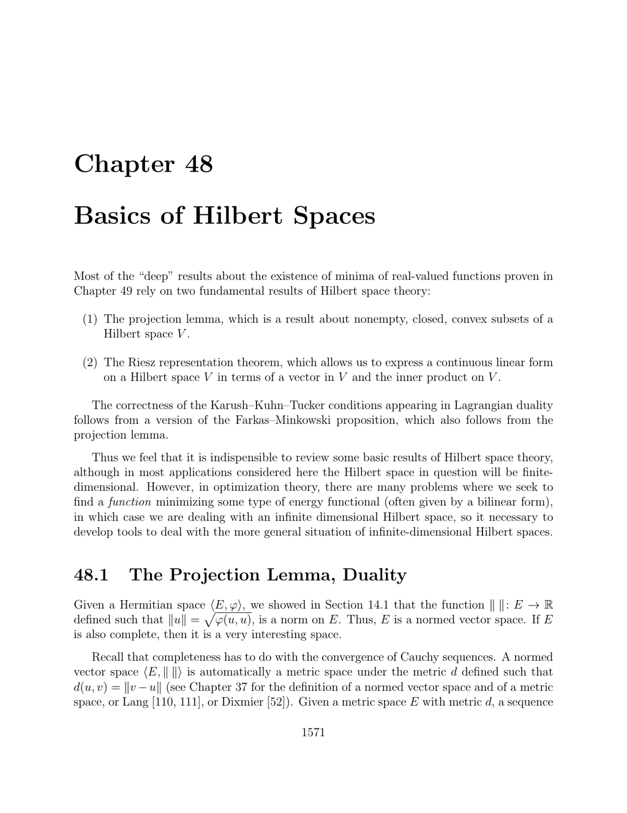

- **Basics of Hilbert Spaces**
  - **Introduction and Definitions**
    - Hilbert spaces are complete Hermitian or Euclidean normed vector spaces with inner products inducing the norm.  
    - Completeness ensures properties like orthogonal complements for closed subspaces extend from finite to infinite dimensions.  
    - Examples include the ℓ² space and the non-complete space C∞[a,b], whose completion is L²([a,b]).  
    - Further reading: [Lang's Introduction to Hilbert Spaces](https://link.springer.com/book/10.1007/BF01387204).
  - **Completeness and Metric Spaces**
    - Completeness means every Cauchy sequence converges within the space, a crucial property for Hilbert spaces.  
    - Every finite-dimensional vector space over ℝ or ℂ is complete because all norms are equivalent.  
    - Infinite-dimensional Hermitian spaces may lack completeness, needing completion to become Hilbert spaces.  
    - Further reading: [Rudin's Functional Analysis](https://www.mheducation.com/highered/product/pvEY4e2KzNoCMDPwTjkYwydQ/nor).
  - **Embedding Hermitian Spaces into Hilbert Spaces**
    - Every Hermitian space can be isometrically embedded in a Hilbert space, uniquely up to isomorphism.  
    - Polarity equations allow extension of the inner product to the completion.  
    - The embedding is proved using continuity and extension arguments on inner products and norms.  
    - Further reading: [Schwartz's Functional Analysis](https://link.springer.com/book/10.1007/978-3-540-94227-0).
  - **Orthonormal Bases and Hilbert Bases**
    - Finite-dimensional Hermitian spaces admit orthonormal bases, yielding isomorphisms to ℂⁿ with a standard inner product.  
    - Infinite-dimensional Hilbert spaces may not have bases in the classical sense but possess dense orthogonal families called Hilbert bases.  
    - Every Hilbert space is isomorphic to some ℓ²(K), allowing expansion in terms of Fourier coefficients indexed by K.  
    - Further reading: [Conway's A Course in Functional Analysis](https://link.springer.com/book/10.1007/978-1-4757-5352-3).
  - **Projection Lemma and Duality**
    - The projection lemma guarantees unique projections onto nonempty, closed, convex subsets in Hilbert spaces.  
    - Projections satisfy characterizing inequalities and orthogonality conditions when projected onto closed subspaces.  
    - Projection maps are Lipschitz continuous with constant 1.  
    - Further reading: [Rudin Real and Complex Analysis](https://www.mheducation.com/highered/product/ww4QqkGL1HY0TM7keBkfknjy/nor).
  - **Orthogonal Complements and Direct Sums**
    - Every closed subspace V has an orthogonal complement V⊥ such that E = V ⊕ V⊥.  
    - The projection onto V is linear and characterized by orthogonality conditions.  
    - Orthogonal decompositions enable solution interpretation in optimization problems like least squares.  
    - Further reading: [Dixmier's C*-Algebras](https://link.springer.com/book/10.1007/BF02826716).
  - **Least Squares Problem as Projection**
    - The least squares problem Ax ≈ b has a solution characterized as an orthogonal projection of b onto Im(A).  
    - Solutions satisfy the normal equations AᵀAx = Aᵀb, reflecting the orthogonality of residuals.  
    - Numerical methods like QR and SVD are preferred over solving normal equations directly for stability.  
    - Further reading: [Golub and Van Loan's Matrix Computations](https://www.jhu.edu/golub/).
  - **Dual Space and the Riesz Representation Theorem**
    - The dual space E⁰ consists of all continuous linear functionals on E, which correspond uniquely to vectors in E by the Riesz representation theorem.  
    - This bijection is an isometric, semilinear isomorphism preserving norms and allowing representation of functionals by inner products.  
    - Non-continuous linear forms have dense kernels, highlighting that the dual is naturally taken as continuous operators.  
    - Further reading: [Kadison & Ringrose, Fundamentals of the Theory of Operator Algebras](https://link.springer.com/book/10.1007/978-1-4613-0302-4).
  - **Adjoint Operators and Sesquilinear Forms**
    - Every continuous sesquilinear form defines a unique associated continuous linear operator, preserving norms and self-adjointness in the Hermitian case.  
    - The adjoint of a continuous operator f : E → E exists uniquely and satisfies hf(u), v i = hu, f*(v)i for all u,v ∈ E.  
    - The adjoint map preserves operator norms and has properties such as (f+g)* = f* + g*, (λf)* = λf*, (f∘g)* = g*∘f*, and f** = f.  
    - Further reading: [Reed & Simon, Functional Analysis](https://link.springer.com/book/10.1007/978-1-4612-5421-7).
  - **Farkas–Minkowski Lemma in Hilbert Spaces**
    - For real Hilbert spaces, a vector b lies outside a finite polyhedral cone C if and only if there exists a vector u separating b from C with certain inner product inequalities.  
    - This lemma generalizes finite-dimensional Farkas' theorem to infinite-dimensional Hilbert spaces via the finiteness of generators.  
    - The characterization is given equivalently by the contrapositive of the inner product inequalities with the generators.  
    - Further reading: [Rockafellar, Convex Analysis](https://press.princeton.edu/books/hardcover/9780691015866/convex-analysis).
