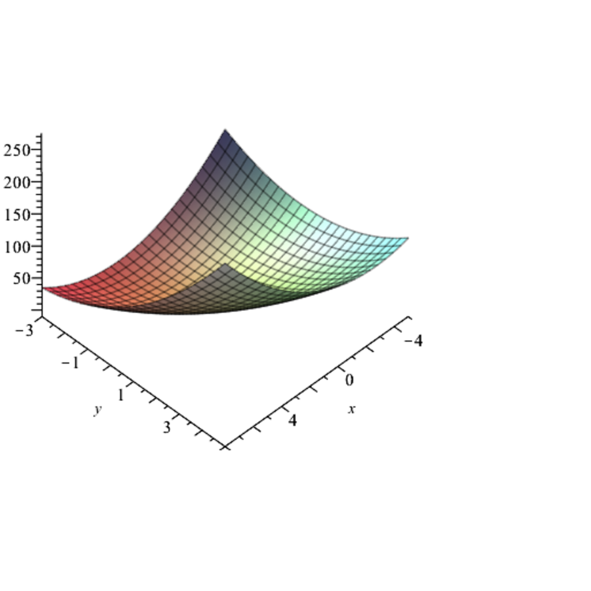

- **Optimization Problems; Basic Terminology**
  - Defines the optimization problem as finding an element \( u \in U \) minimizing \( J(u) \).
  - Explains greatest lower bound (infimum) and least upper bound (supremum) concepts with examples.
  - Introduces terminology such as minimizers, arg min, and treatment of constrained vs unconstrained problems.
  - Mentions types of constraints defining \( U \) and outlines the main questions in optimization theory.
  - References Ciarlet [41] for foundational material.
- **Existence of Solutions of an Optimization Problem**
  - Introduces coercivity as a key property ensuring existence of minima on unbounded sets.
  - Provides Proposition 49.1 for finite-dimensional closed sets and Theorem 49.2 for infinite-dimensional Hilbert spaces.
  - Establishes existence of solutions under convexity, closedness, and coercivity assumptions.
  - Uses weak convergence and Riesz representation theorem in proof techniques.
  - Suggests further reading: Brezis [31].
- **Minima of Quadratic Functionals**
  - Defines quadratic functionals as symmetric bilinear forms minus linear forms on Hilbert spaces.
  - Derives gradient and Hessian formulas generalizing finite-dimensional analogues.
  - States Theorem 49.4 providing existence and uniqueness under coercivity of the bilinear form.
  - Introduces variational inequalities characterizing solutions.
  - Connects to Stampacchia and Lax–Milgram theorems.
- **Elliptic Functionals**
  - Defines elliptic functionals by strong monotonicity inequalities on gradients.
  - States Theorem 49.8 summarizing strict convexity, coercivity, uniqueness of solutions, and characterization conditions.
  - Provides equivalence of ellipticity with positive definiteness of Hessians.
  - Applies results to quadratic functions and relates to eigenvalues of associated matrices.
  - Suggests further reading: Boyd and Vandenberghe [29].
- **Iterative Methods for Unconstrained Problems**
  - Describes iterative schemes to compute minimizers starting from initial guesses.
  - Introduces steps: choosing descent direction, exact line search or backtracking line search for stepsizes.
  - Presents the relaxation method (coordinate descent) and its convergence for elliptic functionals.
  - Links coordinate descent to Gauss–Seidel method for linear systems.
  - References Ciarlet [41] Section 8.4 for convergence analysis.
- **Gradient Descent Methods for Unconstrained Problems**
  - Recommends choosing descent direction opposite to gradient for maximal decrease.
  - Describes four step size selection techniques: fixed, variable, optimal (steepest descent), and backtracking.
  - Proves convergence of optimal step size gradient method for elliptic functionals (Proposition 49.13).
  - Highlights orthogonality of consecutive descent directions and error bounds.
  - Includes an illustrative example and recommends Boyd and Vandenberghe [29] Section 9.3.
- **Convergence of Gradient Descent with Variable Stepsize**
  - Adds Lipschitz continuity of gradient as an assumption for convergence.
  - Provides a step size interval condition guaranteeing geometric convergence (Proposition 49.14).
  - Discusses application to quadratic elliptic functionals with improved step size bounds via eigenvalues.
  - Links convergence rate to condition number of matrix \( A \).
  - Mentions preconditioning as a remedy for ill-conditioned problems.
- **Steepest Descent for an Arbitrary Norm**
  - Generalizes steepest descent direction definition to arbitrary norms and their duals.
  - Details explicit formulas for steepest directions under Euclidean, weighted, and \( \ell^1 \) norms.
  - Describes steepest descent procedure with line search and update steps.
  - Notes convergence for any strictly convex function under any norm.
  - Recommends Boyd and Vandenberghe [29] Section 9.4 for full treatment.
- **Newton’s Method For Finding a Minimum**
  - Defines Newton step and decrement using Hessian inverse and gradient.
  - Discusses affine invariance and the Newton iteration with line search and stopping criteria.
  - Summarizes two-phase convergence (damped and quadratic) with complexity estimates.
  - Introduces self-concordant functions enabling coordinate-invariant convergence analysis.
  - References Boyd and Vandenberghe [29] Sections 9.5 and 9.6 for deeper insight.
- **Conjugate Gradient Methods for Unconstrained Problems**
  - Presents conjugate gradient method for elliptic quadratic functionals minimizing over Krylov subspaces.
  - Proves orthogonality of gradients and conjugacy of step increments relative to matrix \( A \).
  - Provides explicit recursive formulas for directions and step sizes (Polak–Ribière and Fletcher–Reeves formulas).
  - Shows method terminates in at most \( n \) steps and outperforms basic gradient descent in practice.
  - Discusses convergence rate linked to condition number and preconditioning.
  - Suggests Trefethen and Bau [174] Lecture 38 and Demmel [49] Section 6.6.5 for additional reading.
- **Gradient Projection Methods for Constrained Optimization**
  - Considers minimization of convex functionals over convex closed subsets of Hilbert spaces.
  - Equates optimality conditions to fixed points of projection maps involving gradient steps.
  - States the characterization \( u = p_U(u - \rho \nabla J u) \) linking projections and gradient mappings.
  - Implies iterative schemes can be constructed by projecting gradient steps back to feasible set.
  - References projection lemma (Proposition 48.5) and convex analysis foundations.
