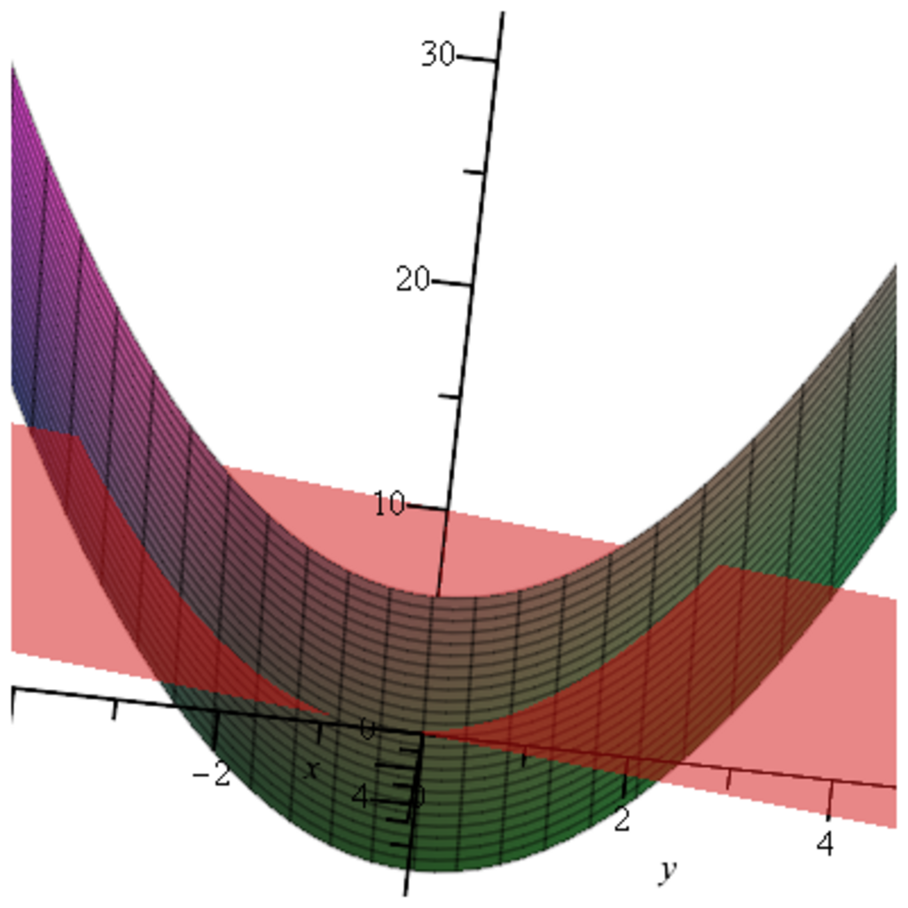

- **Dual Ascent Methods; ADMM**
  - **52.1 Dual Ascent**
    - Describes solving equality-constrained convex minimization problems via dual function gradient ascent.
    - Details the update rule alternating between minimizing the Lagrangian over primal variables and updating dual variables.
    - Explains the method's decomposability when the function and constraints are separable.
    - Notes the method's potential divergence without penalty regularization.
    - Further reading: [Boyd et al. on ADMM](https://web.stanford.edu/~boyd/papers/pdf/admm_distr_stats.pdf)
  - **52.2 Augmented Lagrangians and the Method of Multipliers**
    - Introduces the augmented Lagrangian by adding a quadratic penalty to improve robustness.
    - Defines the method of multipliers as dual ascent applied to the augmented Lagrangian dual.
    - Provides examples demonstrating convergence even for non-convex or non-strictly convex functions given appropriate penalty parameters.
    - Highlights the loss of separability due to the penalty term.
    - Further reading: [Bertsekas, Nonlinear Programming](https://mitpress.mit.edu/books/nonlinear-programming)
  - **52.3 ADMM: Alternating Direction Method of Multipliers**
    - Presents ADMM as a hybrid that preserves decomposability and enjoys superior convergence.
    - Splits the original function into two separable parts with a linear coupling constraint.
    - Performs alternating minimization over each primal block followed by a dual variable update.
    - Provides scaled and unscaled forms; states conditions for step computations.
    - Further reading: [Boyd et al. on ADMM](https://web.stanford.edu/~boyd/papers/pdf/admm_distr_stats.pdf)
  - **52.4 Convergence of ADMM**
    - Establishes convergence under assumptions of convexity, existence of saddle points, and full rank constraint matrices.
    - Proves residual convergence to zero, objective value convergence to optimum, and primal-dual variable convergence.
    - Shows Assumption (2) (full rank A,B matrices) is redundant but simplifies convergence proofs.
    - Includes counterexamples illustrating failure when assumptions do not hold.
    - Further reading: [Boyd et al. on ADMM convergence](https://web.stanford.edu/~boyd/papers/pdf/admm_distr_stats.pdf)
  - **52.5 Stopping Criteria**
    - Defines primal and dual residuals as key metrics for convergence monitoring.
    - Suggests tolerances for stopping based on residual magnitudes and iterative primal-dual objective gap bounds.
    - Discusses adaptive penalty parameter update strategies to accelerate convergence.
    - References practical parameter choice guidelines.
    - Further reading: [Boyd et al. on ADMM stopping criteria](https://web.stanford.edu/~boyd/papers/pdf/admm_distr_stats.pdf)
  - **52.6 Some Applications of ADMM**
    - Describes exploiting structure in functions and constraints to simplify and efficiently compute ADMM steps.
    - Covers cases with identity or structured matrices, proximal operators, and quadratic objectives with linear equality constraints.
    - Presents formulations and ADMM steps for convex minimization over convex sets and quadratic programming.
    - Identifies ADMM's effectiveness for large-scale quadratic problems including support vector machines.
    - Further reading: [Boyd et al. on ADMM applications](https://web.stanford.edu/~boyd/papers/pdf/admm_distr_stats.pdf)
  - **52.7 Applications of ADMM to `1-Norm Problems**
    - Analyzes the soft thresholding (shrinkage) operator as the proximal operator for the `1 norm.
    - Applies ADMM to least absolute deviation, basis pursuit, general `1-regularized loss, lasso, generalized lasso, and group lasso problems.
    - Demonstrates efficient iterations combining proximal operators and projections onto constraint sets.
    - Emphasizes ADMM's role in promoting sparsity and handling high-dimensional statistical learning problems.
    - Further reading: [Hastie, Tibshirani, and Wainwright, Statistical Learning](https://web.stanford.edu/~hastie/Papers/ESLII.pdf)
  - **52.8 Summary**
    - Recaps the main concepts: dual ascent, augmented Lagrangians, penalty parameters, method of multipliers, ADMM algorithmic steps.
    - Highlights key topics including scaled ADMM, residuals, stopping rules, proximity operators, quadratic programming, KKT conditions.
    - Identifies important operators: soft thresholding and shrinkage.
    - Serves as a concise conceptual compendium for algorithms involving equality and convex constraints.
    - Further reading: [Boyd et al. comprehensive ADMM review](https://web.stanford.edu/~boyd/papers/pdf/admm_distr_stats.pdf)
