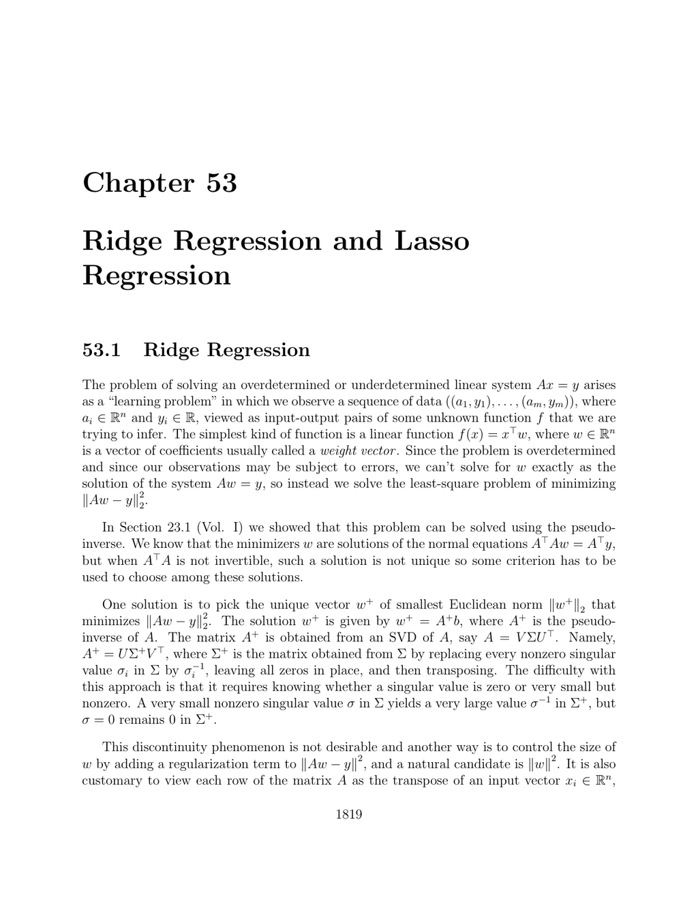

- **53.1 Ridge Regression**  
  - Ridge regression solves least squares problems by adding an \( \ell_2 \)-norm regularization term \( K\|w\|_2^2 \) to minimize weights magnitude and ensure uniqueness.  
  - The solution \( w = (X^\top X + KI_n)^{-1} X^\top y \) converges to the pseudo-inverse solution as \( K \to 0 \).  
  - Dual formulation represents the solution as a linear combination of data points and facilitates kernel ridge regression by replacing inner products with kernels.  
  - Affine models incorporate an intercept term \( b \) with several equivalent formulations, including centering data or penalizing \( b \), with practical preference for centering.  
  - Kernel methods generalize ridge regression to high-dimensional feature spaces using kernels \( \kappa(u,v) \), enabling efficient computation via Gram matrices.  
  - For further reading, see [Shawe-Taylor and Cristianini, Kernel Methods](https://www.cambridge.org/core/books/learning-with-kernels/A4B70868BF3D6DD629E31A5ABAAF537B).

- **53.2 Lasso Regression (\(\ell_1\)-Regularized Regression)**  
  - Lasso regression replaces the \( \ell_2 \)-norm penalty with an \( \ell_1 \)-norm penalty \( K \|w\|_1 \) to promote sparsity in the coefficient vector \( w \).  
  - The \( \ell_1 \)-norm's nondifferentiability is handled by reformulating lasso as a linear program with auxiliary variables.  
  - The dual lasso problem minimizes squared error subject to \( \|X^\top \lambda\|_\infty \le K \), with primal-dual relations characterizing optimality.  
  - Support and sign of the solution obey specific conditions that can theoretically determine nonzero coefficients but are not practical for direct computation.  
  - Intercept \( b \) inclusion follows approaches analogous to ridge regression, with centering preferred to avoid bias penalty issues; alternatively, penalizing \( b \) leads to lack of invariance to shifts in \( y \).  
  - Methods such as ADMM or gradient variants are recommended for solving lasso efficiently; see [Hastie, Tibshirani, and Wainwright, Statistical Learning](https://web.stanford.edu/~hastie/StatLearnSparsity/index.html).

- **53.3 Summary**  
  - The chapter covers key concepts of ridge regression, kernel ridge regression, kernel functions, and lasso regression.  
  - Ridge regression controls solution stability via \( \ell_2 \)-regularization, while lasso enforces sparsity using \( \ell_1 \)-regularization.  
  - Kernel approaches elevate linear methods to nonlinear feature spaces through kernel functions.  
  - Lasso dual formulations provide insights into sparsity-inducing constraints and optimality conditions.
