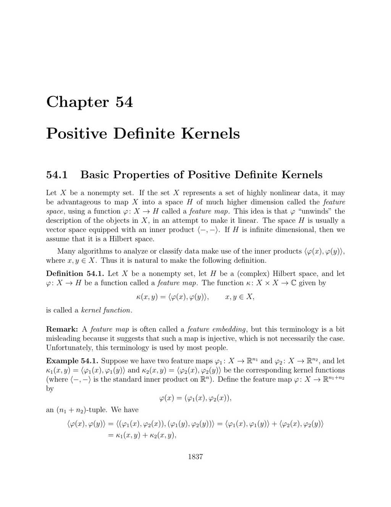

- **Positive Definite Kernels**
  - **Basic Properties of Positive Definite Kernels**
    - Defines kernel functions as inner products induced by feature maps into Hilbert spaces.  
    - Provides multiple examples illustrating kernel functions arising from polynomial and set-based feature maps.  
    - Establishes that kernel matrices built from positive definite kernels are positive semidefinite.  
    - Discusses properties of kernel matrices including hermiticity and the Cauchy–Schwarz inequality.  
    - Covers operations preserving positive definiteness such as sums, products, and scaling.  
    - References foundational texts like Shawe–Taylor and Christianini [157] for kernel variations.
  - **Hilbert Space Representation of a Positive Kernel**
    - Presents the construction of reproducing kernel Hilbert spaces (RKHS) from any positive definite kernel.  
    - Demonstrates the existence of an inner product making the kernel a reproducing kernel.  
    - Shows linear and injective embedding of the RKHS into the function space on X with the reproducing property.  
    - Relates positive definite kernels on groups to unitary representations via the Gelfand–Raikov theorem.  
    - Provides a measure-theoretic example with intersection kernels using characteristic functions in L² spaces.
  - **Kernel PCA**
    - Extends principal component analysis to data implicitly mapped into feature spaces via kernels.  
    - Addresses centering data and computing inner products without explicit feature maps using kernel matrices.  
    - Describes the relation between kernel matrices, singular value decompositions, and dual variables.  
    - Defines kernel principal components as linear combinations derived from kernel eigenvalues and eigenvectors.  
    - Connects kernel PCA to classical PCA while resolving the lack of explicit access to feature vectors.  
  - **ν-SV Regression**
    - Introduces ν-support vector regression, fitting affine functions with ε-insensitive losses and slack variables.  
    - Formulates the constrained optimization problem balancing model complexity, tube width ε, and violations.  
    - Specifies variables: regression coefficients, bias, tube radius, and slack variables with linear constraints.  
    - Highlights the interaction and mutual exclusivity of data points lying inside or outside the ε-tube based on slack variables.  
    - Serves as a foundation for generalizing ridge regression using kernel methods.  
    - Further reading on kernel methods and regression can be found in [Schölkopf and Smola, 2002](https://mitpress.mit.edu/books/learning-kernels) and [Shawe-Taylor and Cristianini, 2004](https://www.cambridge.org/core/books/kernel-methods-for-pattern-analysis/06607E96CEECCF234C308E42EBDCA281).
