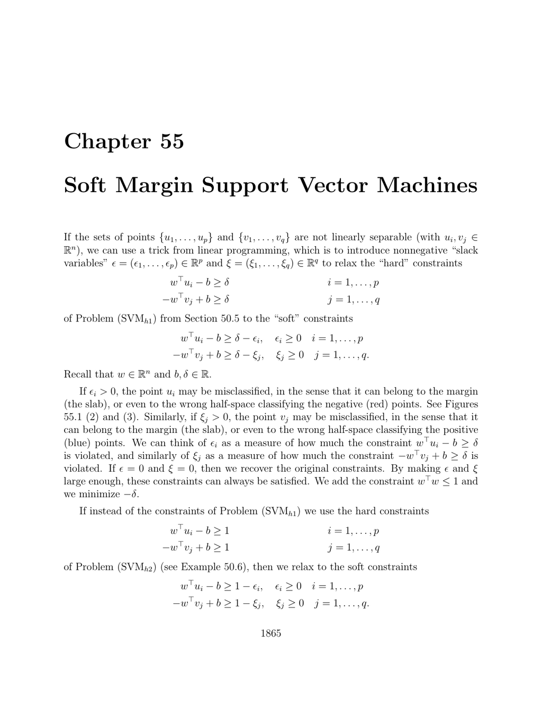

- **Soft Margin Support Vector Machines**
  - **Introduction to soft margin SVM**
    - Introduces slack variables to relax hard linear separability constraints for non-separable data.
    - Describes the trade-off between maximizing the margin and minimizing misclassification via slack variables.
    - Explains that classification depends only on inner products of data, enabling kernel methods.
    - Recommends key references: [Schölkopf and Smola](https://example.org), [Shawe-Taylor and Christianini](https://example.org), [Bishop](https://example.org).
  - **55.1 Soft Margin Support Vector Machines; (SVMs1)**
    - Formulates a primal problem minimizing negative margin plus a linear penalty on slack variables with a convex constraint on the weight norm.
    - Discusses dual function derivation, including conditions when dual yields no information about the primal solution.
    - Explains box constraints on dual variables and conditions for uniqueness and determination of parameters.
    - Provides kernelized dual formulation expressing everything in terms of kernel functions.
    - Highlights the challenge caused by the norm constraint w>w ≤ 1.
  - **55.2 Soft Margin Support Vector Machines; (SVMs2)**
    - Considers minimizing half the squared norm of w plus a linear penalty on slack variables without explicit norm constraint.
    - Presents the classical SVM formulation studied in foundational texts (e.g., Vapnik, Bishop).
    - Details dual problem derivation with box constraints and sum constraints on Lagrange multipliers.
    - Provides classification rules relating multipliers to data point positions relative to margins.
    - Extends results to kernelized version retaining the structure of dual optimization.
  - **55.3 Soft Margin Support Vector Machines; (SVMs20)**
    - Introduces margin scaling by a variable η and includes both a linear penalty on slack variables and an explicit margin scaling term in the objective.
    - Specifies parameters Km and Ks controlling margin influence and sparsity regularization.
    - Defines parameter ν relating Km, Ks, and dataset sizes to bound misclassification.
    - States standard margin hypothesis for existence and determination of solution parameters.
    - Presents dual problem with equality and inequality constraints involving sums and bounds of dual variables.
    - Provides guarantees on maximal misclassified points and margin-error points based on ν values.
    - Discusses kernelized version expressing dual and classification entirely via kernel matrix.
  - **55.4 Soft Margin SVM; (SVMs3)**
    - Formulates a quadratic penalty on slack variables replacing the linear penalty used in SVMs20.
    - Removes nonnegativity constraints on slack variables based on quadratic penalty arguments.
    - Derives dual program featuring regularization term added to kernel matrix, positive definite form.
    - Comments that solutions necessarily involve some misclassified points when sets are not separable.
    - Presents kernelized dual with adjustment to kernel matrix, maintaining problem structure.
  - **55.5 Soft Margin Support Vector Machines; (SVMs4)**
    - Extends SVMs20 by adding half the square of the bias term b to the objective, ensuring determination of b in dual.
    - Supplements dual objective by quadratic term in sums of dual variables weighted by vectors of ones.
    - Eliminates constraint η ≥ 0 as the positivity of η follows from dual relationships.
    - Provides explicit formulas to compute b and η under standard margin hypothesis.
    - Includes kernelized dual version adjusting objective with bias-dependent terms.
  - **55.6 Soft Margin SVM; (SVMs5)**
    - Extends SVMs3 by including the bias squared term in the objective, removing the η ≥ 0 constraint.
    - Derives dual problem with added regularization matrix combining kernel and bias terms.
    - Provides closed-form expressions linking slack variables and dual multipliers due to quadratic penalty.
    - Ensures at least one misclassified point exists in non-separable case as slack variables relate directly to multipliers.
    - Presents kernelized dual program with bias adjustment identical in structure to the non-kernel case.
  - **55.7 Summary and Comparison of the SVM Methods**
    - Summarizes six soft margin SVM formulations differing in objective structure and constraints.
    - Highlights differences in dual formulations, including presence or absence of norm constraints and bias regularizations.
    - Emphasizes standard margin hypothesis as a mild sufficient condition for parameter determination.
    - Points to VC dimension and statistical learning theory for theoretical underpinnings, referring to Vapnik’s works.
    - Notes that kernelization applies uniformly across all methods using inner product representations.
