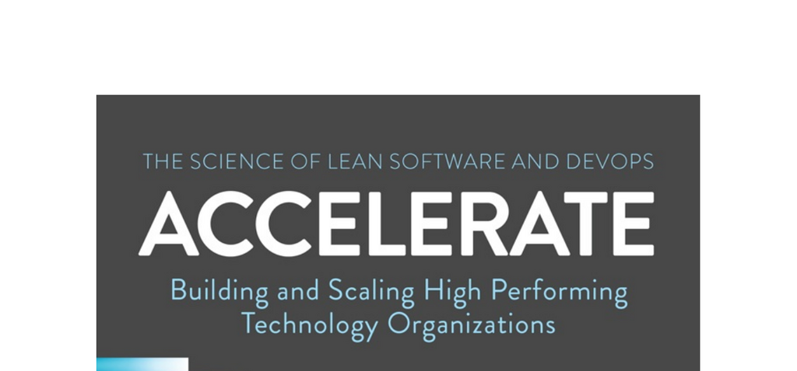

- **Forewords and Preface**
  - **Foreword by Martin Fowler**
    - Introduction and endorsement by Martin Fowler are provided.
  - **Foreword by Courtney Kissler**
    - Perspective and insights from Courtney Kissler are offered.
  - **Quick Reference: Capabilities to Drive Improvement**
    - Lists 24 capabilities driving improvement in software delivery.
    - Capabilities are grouped into continuous delivery, architecture, product and process, lean management and monitoring, and cultural.
    - Details and chapters referencing these capabilities are provided.
  - **Preface**
    - Overview and motivation for the book’s research and findings.

- **Part I: What We Found**
  - **1. Accelerate**
    - Organizations must accelerate delivery, engagement, anticipation, and response to remain competitive.
    - Software and technology serve as key differentiators across industries.
    - The book advocates a capabilities-based approach rather than maturity models for continuous improvement.
    - Research identifies 24 key capabilities that improve software delivery and organizational outcomes.
    - Notable examples include Netflix, Amazon, Capital One, and the US Federal Government's tech services.
    - For more on DevOps see [DevOps Research](https://continuousdelivery.com/2016/04/the-flaw-at-the-heart-of-bimodal-it/).
  - **2. Measuring Performance**
    - Existing metrics like lines of code, velocity, and utilization have significant flaws.
    - Defines four key measures of software delivery performance: lead time, deployment frequency, time to restore service, and change fail rate.
    - Cluster analysis identifies high, medium, and low performers in software delivery.
    - High performers exhibit significantly better tempo and stability metrics without trade-offs.
    - Software delivery performance strongly predicts organizational outcomes like profitability and customer satisfaction.
    - Measurement should be used carefully to support learning culture, avoiding fear-based control.
    - See [Lean Software Development](https://www.lean.org) for related measurement principles.
  - **3. Measuring and Changing Culture**
    - Culture is defined and modeled using Westrum’s typology: pathological, bureaucratic, and generative.
    - Culture is measurable using validated Likert-scale survey questions.
    - Generative culture promotes trust, collaboration, and mission focus, improving information flow.
    - Research shows culture predicts software delivery and organizational performance as well as job satisfaction.
    - Implementing Lean management and continuous delivery technical practices improves culture.
    - For detailed cultural models see [Edgar Schein on Organizational Culture](https://sloanreview.mit.edu/article/edgar-schein-on-organizational-culture/).
  - **4. Technical Practices**
    - Technical practices like continuous integration, test automation, and deployment automation are essential.
    - These practices enable higher quality, lower risk, and more frequent software releases.
    - Agile approaches must include technical practices, not only management processes.
    - Continuous delivery practices measurably impact software delivery performance, culture, burnout, and deployment pain.
    - Refer to [Continuous Delivery by Humble and Farley](https://continuousdelivery.com/book/) for detailed guidance.

- **Part II: The Research**
  - **12. The Science Behind This Book**
    - Explains the scientific methods used in the research program.
  - **13. Introduction to Psychometrics**
    - Introduces psychometric techniques employed to develop and validate survey measures.
  - **14. Why Use a Survey**
    - Justifies survey methodology for gathering broad, quantitative data on software delivery and culture.
  - **15. The Data for the Project**
    - Describes the data sources, survey demographics, and collection methods used for the study.

- **Part III: Transformation**
  - **16. High-Performance Leadership and Management**
    - Leadership and management practices that drive high performance are discussed.
    - Includes evolving organizational models and team management rhythms.
    - Explains how transformational leadership improves technical and lean capabilities.
    - See [Transformational Leadership](https://hbr.org/2000/07/what-leaders-really-do) for foundational concepts.

- **Conclusion**
  - Summarizes key findings and encourages evidence-based transformation efforts.

- **Appendices and Additional Content**
  - **Appendix A: Capabilities to Drive Improvement**
    - Provides a detailed guide to the 24 key capabilities discussed.
  - **Appendix B: The Stats**
    - Contains statistical summaries and firmographic data about surveyed organizations.
  - **Appendix C: Statistical Methods Used in Our Research**
    - Describes the statistical techniques applied for validity, reliability, and predictive analysis.
  - **Acknowledgments**
    - Credits contributors and supporters of the research and book.
  - **Bibliography**
    - Lists references and sources cited throughout the book.
  - **Index**
    - Helps locate topics and terms within the book.
  - **About the Authors**
    - Biographical details about the authors of the research.
