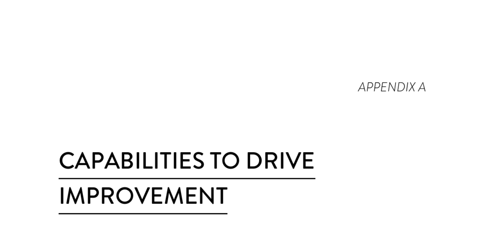

- **Capabilities to Drive Improvement**
  - **Continuous Delivery Capabilities**
    - Use version control for all production artifacts
      - Version control includes systems like GitHub or Subversion for all production artifacts such as code, configurations, and automation scripts.  
      - Using version control supports reproducibility and traceability in software delivery.  
      - See Chapter 4 for detailed coverage.  
      - Further reading: [Version Control with Git](https://git-scm.com/book/en/v2)  
    - Automate your deployment process
      - Deployment automation eliminates manual deployment steps to improve speed and reliability.  
      - Fully automated deployments reduce human errors and increase consistency.  
      - See Chapter 4 for implementation details.  
    - Implement continuous integration
      - Continuous Integration (CI) involves frequent code check-ins triggering automated tests.  
      - CI creates canonical builds and packages used later for deployment and releasing.  
      - Fixing identified regressions quickly is a key practice.  
      - See Chapter 4 for guidance.  
    - Use trunk-based development methods
      - Characterized by fewer than three active branches with short lifetimes merged rapidly into master.  
      - Avoids code freezes and "code lock" periods to facilitate continuous integration.  
      - Predicts higher software development and delivery performance.  
      - See Chapter 4 for more explanation.  
    - Implement test automation
      - Software tests run automatically and continuously, primarily maintained by developers.  
      - Automated test suites must reliably detect genuine failures and validate releasable code.  
      - See Chapter 4 for practices.  
    - Support test data management
      - Maintaining appropriate test data to effectively run automated tests is critical.  
      - Minimizing test data needs where possible improves testing efficiency.  
      - Teams should enable conditioning and on-demand acquisition of test data.  
      - See Chapter 4 for details.  
    - Shift left on security
      - Integrate security reviews and involvement from information security teams early in design and testing phases.  
      - Use preapproved security libraries and test security features within automated test suites.  
      - Early security integration enhances IT performance.  
      - See Chapter 4 for coverage.  
    - Implement continuous delivery (CD)
      - Keep software in a deployable state throughout its lifecycle prioritizing deployability over new features.  
      - Provide fast feedback on system quality and fix deployability issues promptly.  
      - Enable deployment to production or users on demand.  
      - See Chapter 4 for implementation strategies.  
  - **Architecture Capabilities**
    - Use a loosely coupled architecture
      - Teams can test and deploy applications independently without coordination with other services.  
      - Loosely coupled architectures empower teams to deliver value quickly and autonomously.  
      - See Chapter 5 for architectural guidance.  
    - Architect for empowered teams
      - Teams choose their own tools, improving continuous delivery and overall software performance.  
      - Empowerment reflects trust in practitioners’ knowledge about what tools best support their work.  
      - See Chapter 5 for architectural strategies.  
      - Product management empowerment parallels are detailed in Chapter 8.  
  - **Product and Process Capabilities**
    - Gather and implement customer feedback
      - Regularly soliciting and incorporating customer feedback improves software delivery outcomes.  
      - Active customer involvement is important for successful product design.  
      - See Chapter 8 for recommendations.  
    - Make the flow of work visible through the value stream
      - Understand and display the entire flow of work from business input to customer delivery.  
      - Visibility into product and feature status positively impacts IT performance.  
      - See Chapter 8 for detailed methods.  
    - Work in small batches
      - Decompose work into small, manageable pieces that complete within a week or less.  
      - Small batches enable rapid development, shorter lead times, and quicker feedback.  
      - The MVP concept applies at both feature and product levels.  
      - See Chapter 8 for applications.  
    - Foster and enable team experimentation
      - Developers can test new ideas and update specifications without external approval.  
      - Experimentation accelerates innovation and value creation.  
      - Highest impact occurs alongside small batch work, customer feedback incorporation, and visible workflow.  
      - See Chapter 8 for context.  
      - Technical counterparts to this capability are covered in Chapter 4.  
  - **Lean Management and Monitoring Capabilities**
    - Have a lightweight change approval processes
      - Peer review methods like pair programming or intrateam code review outperform external change approval boards (CABs).  
      - Lightweight change approval processes improve IT performance.  
      - See Chapter 7 for best practices.  
    - Monitor across application and infrastructure to inform business decisions
      - Use monitoring data not just for incident response but also for proactive business decision-making.  
      - Integration of application and infrastructure data supports informed management choices.  
      - See Chapter 7 for details.  
    - Check system health proactively
      - Employ threshold and rate-of-change alerts to detect and address problems early.  
      - Proactive health monitoring improves system stability and responsiveness.  
      - See Chapter 13 for monitoring techniques.  
    - Improve processes and manage work with work-in-process (WIP) limits
      - WIP limits control flow of work, revealing bottlenecks and driving process improvements.  
      - Applying WIP limits increases throughput and makes systemic constraints visible.  
      - See Chapter 7 for implementation advice.  
    - Visualize work to monitor quality and communicate throughout the team
      - Use visual tools like dashboards or websites to track quality metrics and work status.  
      - Visualization enhances communication and supports performance improvements.  
      - See Chapter 7 for examples.  
  - **Cultural Capabilities**
    - Support a generative culture (as outlined by Westrum)
      - Characterized by good information flow, high cooperation and trust, bridging between teams, and conscious inquiry.  
      - Generative culture predicts better IT and organizational performance plus reduced burnout.  
      - Based on sociologist Ron Westrum’s typology focused on safety-critical systems.  
      - See Chapter 3 for cultural assessment.  
    - Encourage and support learning
      - Learning is considered a strategic investment, essential for ongoing progress.  
      - Cultures that prioritize learning improve software delivery and organizational capabilities.  
      - See Chapter 10 for learning culture evaluation.  
    - Support and facilitate collaboration among teams
      - Collaboration bridges traditional silos among development, operations, and information security teams.  
      - Improved cross-team interaction enhances performance and efficiency.  
      - See Chapters 3 and 5 for collaboration strategies.  
    - Provide resources and tools that make work meaningful
      - Job satisfaction stems from challenging, meaningful work and empowerment to use skills and judgment.  
      - Providing adequate tools and resources is critical for effective work execution.  
      - See Chapter 10 for measurement approaches.  
    - Support or embody transformational leadership
      - Transformational leadership includes vision, intellectual stimulation, inspirational communication, supportive leadership, and personal recognition.  
      - This leadership style amplifies technical and process improvements essential to DevOps success.  
      - See Chapter 11 for leadership development.
