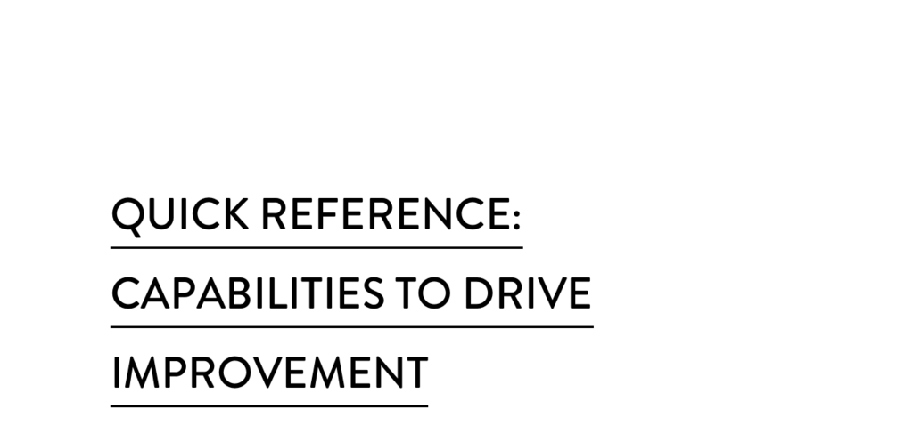

- **Capabilities to Drive Improvement**
  - **Continuous Delivery Capabilities**
    - **Version control**
      - The practice involves managing changes to source code in a systematic way to enable efficient software delivery.
      - It facilitates collaboration among developers and maintains a history of changes.
      - Detailed discussion is found in Chapter 4.
      - Further reading: [Version Control Best Practices](https://git-scm.com/book/en/v2)
    - **Deployment automation**
      - Automates the process of delivering software to production environments.
      - Reduces errors and increases reliability in software deployments.
      - Explored extensively in Chapter 4.
      - Further reading: [Continuous Deployment](https://martinfowler.com/bliki/ContinuousDelivery.html)
    - **Continuous integration**
      - Involves frequently merging code changes into a shared repository.
      - Enables early detection of integration issues and improves software quality.
      - Covered in Chapter 4.
      - Further reading: [Continuous Integration Explained](https://www.thoughtworks.com/continuous-integration)
    - **Trunk-based development**
      - Developers integrate code into a shared main branch regularly.
      - Supports rapid delivery and reduces merge conflicts.
      - Explained in Chapter 4.
      - Further reading: [Trunk-Based Development](https://trunkbaseddevelopment.com/)
    - **Test automation**
      - Automates the execution of tests to ensure software quality.
      - Speeds up feedback loops and supports continuous delivery.
      - Discussed in Chapter 4.
      - Further reading: [Test Automation Fundamentals](https://www.softwaretestinghelp.com/test-automation/)
    - **Test data management**
      - Manages the creation and maintenance of test data sets.
      - Ensures tests are reliable and reflect real-world scenarios.
      - Found in Chapter 4.
      - Further reading: [Test Data Management Practices](https://tdan.com/test-data-management-the-ultimate-guide/23526)
    - **Shift left on security**
      - Integrates security practices early in the development lifecycle.
      - Minimizes vulnerabilities by addressing security proactively.
      - Covered in Chapter 6.
      - Further reading: [Shift-Left Security](https://owasp.org/www-community/Shift_Left_Security)
    - **Continuous delivery (CD)**
      - Encompasses automated building, testing, and deployment of software.
      - Improves release frequency and reliability.
      - Detailed in Chapter 4.
      - Further reading: [Continuous Delivery Principles](https://continuousdelivery.com/)
  - **Architecture Capabilities**
    - **Loosely coupled architecture**
      - Designs components to minimize dependencies among them.
      - Facilitates easier changes and faster delivery cycles.
      - Discussed in Chapter 5.
      - Further reading: [Microservices and Loose Coupling](https://martinfowler.com/articles/microservices.html)
    - **Empowered teams**
      - Teams have authority and autonomy to make decisions.
      - Enhances responsiveness and innovation.
      - Covered in Chapter 5.
      - Further reading: [Team Empowerment in Agile](https://www.agilealliance.org/agile101/employee-empowerment/)
  - **Product and Process Capabilities**
    - **Customer feedback**
      - Involves actively gathering and integrating user input into development.
      - Drives product improvements and alignment with user needs.
      - Found in Chapter 8.
      - Further reading: [Customer Feedback Strategies](https://www.productplan.com/glossary/customer-feedback/)
    - **Value stream**
      - Maps the end-to-end flow of delivering value to customers.
      - Identifies bottlenecks and opportunities for improvement.
      - Detailed in Chapter 8.
      - Further reading: [Value Stream Mapping](https://www.lean.org/WhoWeAre/NewsArticleDocuments/Value_Stream_Mapping.pdf)
    - **Working in small batches**
      - Breaks work into small, manageable pieces for faster feedback.
      - Reduces risk and enables continuous improvement.
      - Discussed in Chapter 8.
      - Further reading: [Lean Software Development](https://www.lean.org/lexicon/small-batches)
    - **Team experimentation**
      - Encourages teams to try new ideas and learn from outcomes.
      - Fosters innovation and adaptability.
      - Covered in Chapter 8.
      - Further reading: [The Role of Experimentation](https://hbr.org/2011/12/the-experimentation-advantage)
  - **Lean Management and Monitoring Capabilities**
    - **Change approval processes**
      - Formal procedures to review and authorize changes.
      - Balances speed with risk management.
      - Found in Chapter 7.
      - Further reading: [Change Management Best Practices](https://www.itil.org/en/change-management)
    - **Monitoring**
      - Continuous observation of systems to detect issues and performance trends.
      - Enables proactive responses to problems.
      - Detailed in Chapter 7.
      - Further reading: [Application Performance Monitoring](https://www.datadoghq.com/what-is-apm/)
    - **Proactive notification**
      - Alerts teams promptly about critical system events.
      - Supports rapid incident response.
      - Discussed in Chapter 13.
      - Further reading: [Incident Notification Systems](https://pagerduty.com/)
    - **WIP limits**
      - Sets caps on work in progress to prevent overload.
      - Improves flow and reduces multitasking.
      - Covered in Chapter 7.
      - Further reading: [Kanban WIP Limits](https://kanbanize.com/kanban-resources/getting-started/kanban-wip-limits)
    - **Visualizing work**
      - Uses visual tools to display work status and progress.
      - Enhances transparency and team coordination.
      - Found in Chapter 7.
      - Further reading: [Visual Management Techniques](https://www.lean.org/lexicon/visual-management)
  - **Cultural Capabilities**
    - **Westrum organizational culture**
      - Defines organizational typologies influencing information flow.
      - A generative culture improves communication and risk management.
      - Discussed in Chapter 3.
      - Further reading: [Westrum Culture Typology](https://itrevolution.com/culture/)
    - **Supporting learning**
      - Encourages continuous education and skill development.
      - Drives improvement and adaptation.
      - Covered in Chapter 10.
      - Further reading: [Learning Organizations](https://hbr.org/1993/07/building-the-learning-organization)
    - **Collaboration among teams**
      - Promotes cross-team communication and cooperation.
      - Enhances problem-solving and efficiency.
      - Found in Chapters 3 and 5.
      - Further reading: [Effective Team Collaboration](https://www.atlassian.com/team-playbook/plays/cross-team-collaboration)
    - **Job satisfaction**
      - Measures the extent employees find work fulfilling.
      - Influences retention and productivity.
      - Discussed in Chapter 10.
      - Further reading: [Job Satisfaction Factors](https://www.apa.org/topics/job-satisfaction)
    - **Transformational leadership**
      - Leadership style that motivates and inspires change.
      - Supports organizational growth and innovation.
      - Covered in Chapter 11.
      - Further reading: [Transformational Leadership](https://www.mindtools.com/pages/article/transformational-leadership.htm)
