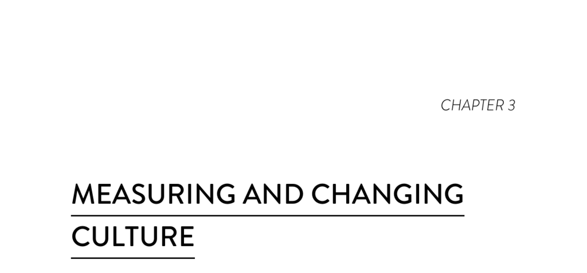

- **Modeling and Measuring Culture**
  - **Organizational Culture Levels**
    - Organizational culture exists at three levels: basic assumptions, values, and artifacts as defined by Schein (1985).  
    - Basic assumptions are implicit and difficult to articulate, formed as members interpret events over time.  
    - Values are visible norms and collective views that influence group interactions and provide social rules.  
    - Artifacts are the most visible and include mission statements, technology, procedures, and rituals.  
    - See Edgar H. Schein's work on organizational culture for foundational concepts.  
  - **Westrum’s Typology of Organizational Culture**
    - Westrum identifies three culture types: pathological (power-oriented), bureaucratic (rule-oriented), and generative (performance-oriented).  
    - Pathological cultures feature fear, information hoarding, and scapegoating; bureaucratic cultures emphasize rules and departmental protection; generative cultures prioritize mission and high cooperation.  
    - These culture types predict information flow characteristics such as timeliness and utility.  
    - Refer to Westrum’s original research (2014) for detailed typology.  
  - **Measuring Culture Using Likert-Scale**
    - Culture measurement leverages Westrum’s continuum through Likert-type survey questions with a 1 to 7 agreement scale.  
    - Strongly worded statements derived from Westrum’s model enable respondents to provide meaningful agreement or disagreement.  
    - Surveys must be validated for consistent interpretation and construct validity before analytical use.  
    - For more on Likert scales, see [Likert Scale Overview](https://en.wikipedia.org/wiki/Likert_scale).  
  - **Analyzing Constructs: Validity and Reliability**
    - Validity analysis ensures the survey items measure the intended construct (organizational culture) accurately (discriminant and convergent validity).  
    - Reliability analysis verifies internal consistency and uniform interpretation across respondents.  
    - Combined validity and reliability confirm the survey construct’s suitability for further research.  
    - Additional statistical methods are detailed in Appendix C of the document.  
  - **Outcomes Predicted by Westrum Organizational Culture**
    - Generative cultures are associated with enhanced collaboration, trust, and mission focus across hierarchical levels.  
    - Such cultures promote improved information flow, decision-making quality, and quicker problem identification.  
    - Positive correlations exist between generative culture and software delivery performance, organizational performance, and job satisfaction.  
    - These relationships are visually summarized in Figure 3.2 of the text.  
  - **Consequences of Westrum’s Theory for Technology Organizations**
    - The theory, initially developed for safety outcomes, extends to predicting software delivery and organizational performance.  
    - High-performing teams emphasize culture features like trust, cooperation, and mission-driven behavior.  
    - Google’s research confirms team dynamics are more critical than individual traits for effectiveness.  
    - Failure management in generative cultures focuses on systemic investigation rather than assigning blame, consistent with complex systems theory (Perrow 2011).  
    - See [Project Aristotle by Google](https://rework.withgoogle.com/print/guides/5721312655835136/) for related research.  
- **The Delivery Performance Construct**
  - Software delivery performance is measured by three validated metrics: lead time, release frequency, and time to restore service.  
  - Change fail rate does not statistically fit into the construct but correlates strongly with it.  
  - These metrics collectively differentiate high, medium, and low performing teams.  
  - Definitions and implications are further explained in Chapter 2 and in related software delivery research.  
- **How Do We Change Culture?**
  - Behavioral change precedes cultural change; modifying actions leads to new cultural norms (John Shook’s experience).  
  - Implementing Lean management and continuous delivery practices drives improvements in organizational culture.  
  - Improvements in culture derive from adopting specific technical and management practices that encourage collaboration and trust.  
  - Related case study is documented in episode 561 of This American Life (2015).  
  - For background on Lean principles, consult [Lean Enterprise Institute](https://www.lean.org).
