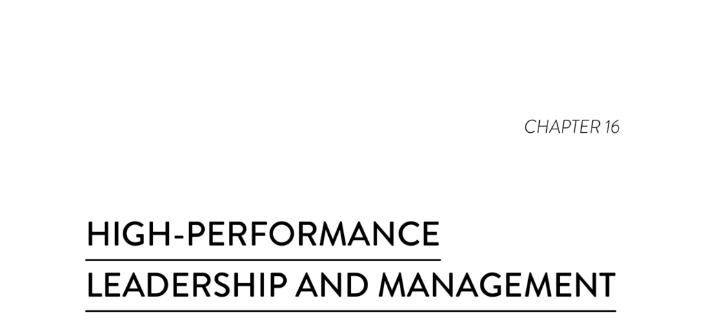

- **High-Performance Leadership and Management**  
  - **Introduction: Leadership's Impact on Technology Transformation**  
    - Leadership significantly influences team performance in software delivery, system architecture, and Lean practices.  
    - Leadership effects correlate with organizational profitability, productivity, market share, customer satisfaction, and goal achievement.  
    - Despite its importance, leadership's role in DevOps has often been overlooked.  
    - For further insights, see Chapter 11, pp. 115-116, and related research on Lean leadership.  
  - **The Need to Reimagine IT Leadership and Management**  
    - Current competitive advantage depends on rapid and effective delivery of technology-enabled customer value.  
    - Technical performance alone is insufficient without alignment to customer priorities and enterprise strategy.  
    - Sustaining advantage requires a lightweight, high-performance management framework linking strategy to action.  
    - The framework must facilitate rapid feedback, learning, and leverage creative capabilities enterprise-wide.  
  - **A High-Performing Management Framework in Practice**  
    - Proven Lean management practices correlate with high organizational performance beyond financial metrics.  
    - ING Netherlands exemplifies digital banking innovation and customer-centric technology leadership.  
    - Emphasis is on understanding the "why" behind behaviors rather than copying practices.  
    - For examples of Lean management in IT, see Chapter 2, p. 24.  
  - **ING’s Organizational and Team Structure**  
    - ING uses a multidimensional, matrixed structure with tribes (business lines), squads (self-steering teams), chapters (discipline groups), and centers of expertise.  
    - Teams follow Bezos’ Two Pizza Rule for size and integrate BizDevOps practices.  
    - The structure evolves based on experiential learning, including emergent roles like product area leads.  
  - **Visual Management and the Obeya Method**  
    - Leadership and squads maintain highly visible Obeya rooms with visualized objectives, performance metrics, and problem areas.  
    - Color-coded visual management quickly highlights progress and setbacks.  
    - Visualization promotes transparency, shared understanding, and alignment with enterprise strategy.  
  - **Daily Stand-Ups and Cadence of Learning**  
    - Squads conduct brief daily stand-ups focusing on work in progress, obstacles, and completed tasks.  
    - Issues are flagged but resolved separately through escalation or collaboration, following a “catchball” communication rhythm.  
    - This structure accelerates problem resolution and supports continuous learning and adaptation.  
  - **Leadership as Coaching and Culture Development**  
    - Leaders prioritize coaching behaviors focusing on problem understanding, learning, and team support instead of command-and-control.  
    - Psychological safety is cultivated to encourage open problem discussion without fear.  
    - Improvement is integrated into regular work, with a fixed percentage of squad time dedicated to it.  
  - **Problem Solving and Experimental Approach**  
    - Multiple problem-solving methodologies (A3, Kata, Lean startup) are blended into a situational approach.  
    - Root causes are rigorously analyzed, hypotheses are tested via experiments, and successful improvements become standard work.  
    - Problem-solving cascades from senior leadership to squad levels, ensuring thorough analysis and ownership.  
  - **Standard Work Tailored for Knowledge Work**  
    - Standard work is adapted by teams based on experimentation aligned with their unique contexts.  
    - Standards apply to processes (e.g., Scrum rituals) while preserving flexibility for practice requiring judgment.  
    - Ongoing reevaluation ensures standards evolve with changing conditions.  
  - **Leadership Reflections on Learning and Culture Change**  
    - Management recognized their own learning deficits and modeled continuous learning to enable team learning.  
    - Cultural change was achieved by changing routines and ways of working rather than discussing culture abstractly.  
    - Senior leadership values the approach for delivering speed with quality and sustaining high performance.  
  - **Transforming Leadership, Management, and Team Practices**  
    - Culture change should focus on learning how to learn safely and collectively, rather than fixing culture directly.  
    - Successful transformation starts with leadership willingness to experiment and learn together with teams.  
    - Development of internal coaching capability is emphasized over reliance on external consultants.  
    - Leaders must lead by example and adopt new behaviors themselves.  
  - **Practices for Sustaining Change**  
    - Discipline in time management and willingness to try uncomfortable new behaviors are essential.  
    - Patience is required due to long entrenchment of old habits.  
    - Continuous practice, rhythm, and routines cement new ways until they become habits.  
  - **Conclusion and Encouragement for the Learning Journey**  
    - Ongoing learning and adaptation lead to measurable improvements in quality, speed, leadership growth, innovation, and customer value.  
    - Alignment to enterprise goals improves profitability, productivity, market share, customer satisfaction, and efficiency.  
    - The chapter ends with a hope for readers to embark on their own leadership and culture transformation journey.  
- **Figures and Illustrations**  
  - **Figure 16.1: Leadership Obeya (360-Degree Panorama)**  
    - Shows a visual management room with strategic objectives, using color-coding to indicate status.  
    - Demonstrates how IT objectives are directly linked to enterprise strategy.  
  - **Figure 16.2: ING’s Agile Organizational Model**  
    - Depicts the dynamic and evolving matrixed structure including tribes, squads, chapters, and centers of expertise.  
  - **Figure 16.3: Stand-up and Catchball Rhythm**  
    - Illustrates the communication flow during daily stand-ups and escalation mechanisms.  
  - **Figure 16.4: High-Performance Team, Management, and Leadership Behaviors and Practices**  
    - Provides a comprehensive list of behaviors and practices correlating with high performance, marking those supported by research.  
- **Notes and References**  
  - Notes clarify that IT refers broadly to software and technology processes beyond traditional IT functions.  
  - All ING direct quotes are personal communications with chapter authors.  
  - Suggested external resource for Lean leadership principles: [Lean Enterprise Institute](https://www.lean.org)
