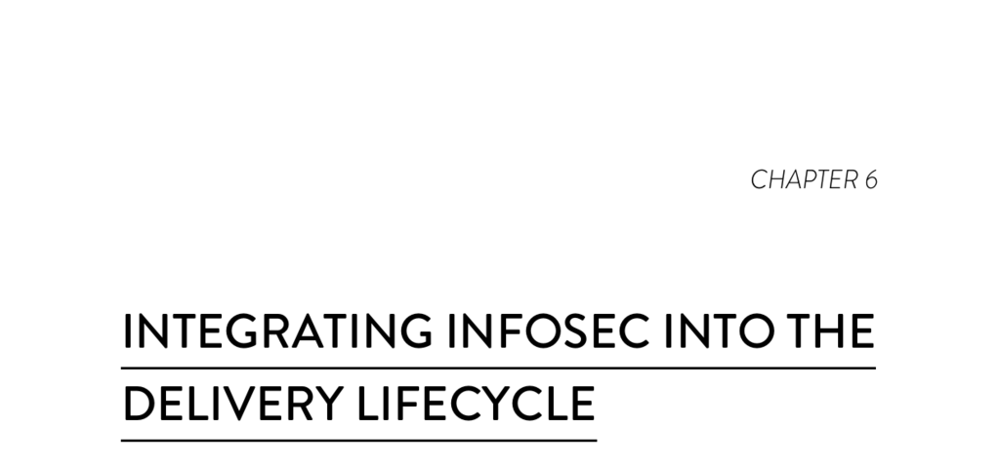

- **Integrating InfoSec into the Delivery Lifecycle**
  - **Role of Infosec in DevOps**
    - Information security teams are often understaffed and involved late in the software delivery lifecycle.  
    - Developers frequently lack knowledge about common security risks like the OWASP Top 10.  
    - Integrating infosec effectively across functions reduces friction and improves delivery outcomes.  
    - See [OWASP Top 10 Project](https://www.owasp.org/index.php/Category:OWASP_Top_Ten_Project) for common security risks.  
  - **Shifting Left on Security**
    - "Shift left" means integrating security earlier in the development process rather than as a final step.  
    - Security reviews occur for major features without slowing development throughput.  
    - Infosec experts contribute from design through testing, with security automated in test suites.  
    - Providing developers with preapproved libraries and tools makes following security best practices easier.  
  - **Benefits of Early Security Integration**
    - Building security into daily development improves delivery performance and security quality.  
    - High-performing organizations spend 50% less time on security issue remediation than low performers.  
    - Early infosec involvement reduces bottlenecks in deploying 'dev complete' systems.  
  - **Compliance in the Federal Government**
    - Federal agencies must comply with FISMA and NIST’s Risk Management Framework (RMF).  
    - The RMF includes System Security Plan preparation and security assessment reports.  
    - Compliance processes often take months or more and start only after development completes.  
    - The cloud.gov platform automates most controls, enabling deployment in weeks instead of months.  
    - Learn more at [cloud.gov FedRAMP Authorization](https://18f.gsa.gov/2017/02/02/cloud-gov-is-now-fedramp-authorized/).  
  - **The Rugged Movement**
    - Rugged DevOps combines DevOps with principles from the Rugged Manifesto focused on secure and resilient code.  
    - The manifesto emphasizes responsibility, anticipation of adversaries, and code that supports its mission under attack.  
    - The movement insists that security is everyone's responsibility in the development lifecycle.  
    - The term Rugged DevOps was coined by Josh Corman and James Wickett.
