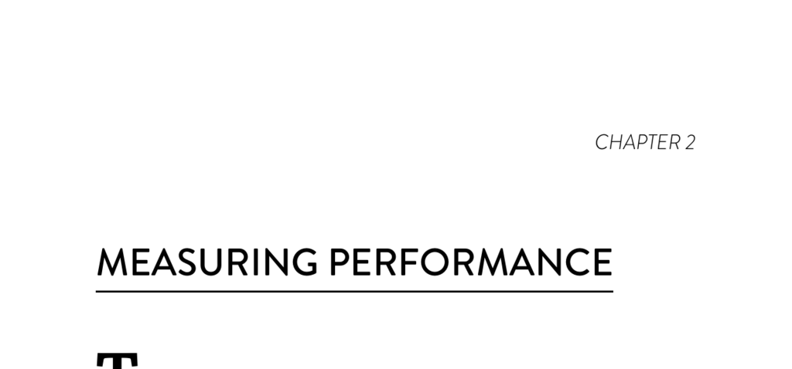

- **The Flaws in Previous Attempts to Measure Performance**  
  - Measuring productivity by lines of code is flawed because it encourages bloated software and does not equate to solving business problems efficiently.  
  - Velocity, derived from Agile story points, is relative, team-dependent, and prone to gaming, which inhibits inter-team collaboration.  
  - Utilization as a productivity metric ignores queueing theory principles, where high utilization beyond a point exponentially increases lead time.  
  - For in-depth understanding of problems with bimodal ITSM, see [The Flaw at the Heart of Bimodal IT](https://continuousdelivery.com/2016/04/the-flaw-at-the-heart-of-bimodal-it/).

- **Measuring Software Delivery Performance**  
  - Product delivery lead time measures time from code committed to running in production, reflecting tempo and predictability of delivery.  
  - Deployment frequency acts as a proxy for batch size, with smaller batches reducing cycle times, risks, and enabling faster feedback.  
  - Time to restore service and change fail rate measure system stability and quality, focusing on how quickly incidents are resolved and failure rates of changes.  
  - Cluster analysis groups organizations into high, medium, and low performers based on these four metrics, with high performers excelling in all.  
  - Lean principles and Reinertsen's work support the importance of lead time and batch size reduction; see Reinertsen (2009) for more.  

- **Software Delivery Performance Categories and Trends**  
  - High performers deploy on demand with lead times under one hour, very low change failure rates, and rapid recovery times.  
  - Medium and low performers show slower deployments, longer lead times, and higher failure rates, with medium performers sometimes having inconsistent change fail rates due to transition challenges.  
  - Over time, high performers improve or maintain performance while low performers struggle to catch up, particularly on stability metrics.  
  - The medium performers’ higher failure rate in 2016 may be due to large-scale rearchitecture and accruing technical debt.

- **The Impact of Delivery Performance on Organizational Performance**  
  - High-performing organizations are twice as likely to exceed goals in profitability, market share, and productivity compared to low performers.  
  - Software delivery performance strongly predicts success in noncommercial goals such as operating efficiency, customer satisfaction, and mission achievement.  
  - The ability to deliver in small batches with rapid feedback loops correlates with technical practices like continuous delivery and A/B testing.  
  - Strategic software development should be kept in-house for competitive advantage; non-strategic software is better procured as a service.  
  - For understanding strategic software differentiation, see [Wardley Mapping](https://wardleymaps.com).

- **Driving Change**  
  - Scientific measurement enables comparison, benchmarking, and prediction of software delivery improvements linked to specific practices.  
  - Some traditional practices like change management boards negatively correlate with delivery tempo and stability.  
  - Culture must be developed before measurements can be effectively used to improve performance; otherwise, fear leads to inaccurate data reporting.  
  - Deming’s principle warns against measurement used as control in bureaucratic cultures, emphasizing the need for a learning culture first.  
  - Refer to Humble et al. (2014, p.56) for culture and measurement dynamics.
