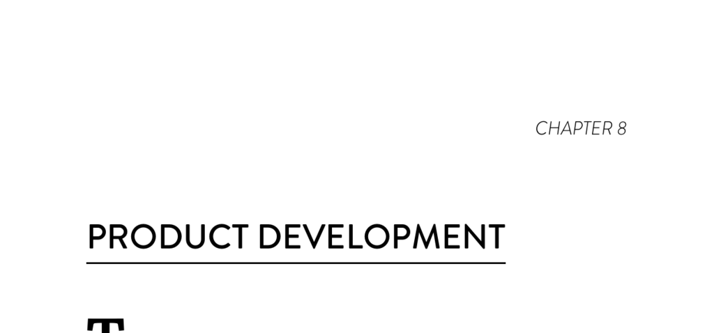

- **Product Development**
  - **Lean Product Development Practices**
    - Four capabilities define the Lean approach: working in small batches including MVPs, understanding and visualizing work flow, regularly incorporating customer feedback, and granting teams authority to change specifications.
    - These capabilities significantly predict improved software delivery, organizational performance, culture, and reduced burnout.
    - The reciprocal relationship between delivery performance and Lean practices creates a virtuous cycle.
    - Further reading: [The Lean Startup](https://en.wikipedia.org/wiki/The_Lean_Startup) by Eric Ries.
  - **Working in Small Batches**
    - Involves decomposing work into features that enable rapid completion and frequent release, including MVPs.
    - Enables short lead times, fast feedback loops, and quick user feedback integration such as A/B testing.
    - Small batch work correlates highly with continuous delivery technical practices.
  - **Gathering Customer Feedback**
    - Comprises regularly collecting satisfaction metrics, seeking insights on product quality, and using feedback to inform product design.
    - Team authority to respond to feedback is critical for effective iteration.
  - **Team Experimentation**
    - Teams must be authorized to create and modify specifications without external approval to support innovation.
    - Restrictions on changing requirements inhibit customer-centric product development and business results.
    - Experimentation must be combined with small batch work, visible workflow, and customer feedback for effectiveness.
  - **Effective Product Management Drives Performance**
    - Lean product management practices positively impact software delivery performance, generative culture, and reduce burnout.
    - Software delivery performance drives Lean practices, forming a virtuous cycle for improved outcomes.
    - Lean practices predict organizational productivity, profitability, and market share.
    - Further reading: [Lean Product and Lean Startup](https://leanstartup.co) concepts.
