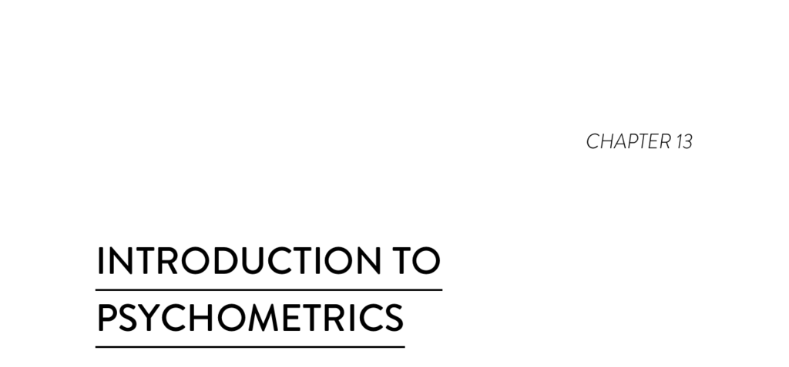

- **Introduction to Psychometrics**
  - **Concerns about survey data quality**
    - Survey data quality concerns often arise from exposure to push polls, quick surveys, and surveys by untrained writers.  
    - Push polls contain biased questions with clear agendas that influence respondents.  
    - Common weaknesses include leading questions, loaded questions, multi-part questions, and unclear language.  
    - For further reading, see [Survey Research Methods](https://methods.sagepub.com/book/survey-research-methods).
  - **Trusting data with latent constructs**
    - Latent constructs measure concepts that cannot be directly observed, like organizational culture.  
    - Manifest variables represent components of latent constructs and are measured through survey items.  
    - Statistical analyses verify that survey items measure the intended latent construct before combining their scores.  
    - See also [Latent Variable Models and Factor Analysis](https://www.cambridge.org/core/books/latent-variable-models/EB507FA6CAEDACD4A03B4BCECCE8AD9E).
  - **Latent constructs help us think carefully about what we’re measuring**
    - Defining the construct precisely prevents ambiguous or misleading survey questions.  
    - Broad or vague questions (e.g., "Is your culture good?") yield unreliable or variable interpretations.  
    - Using Dr. Westrum’s typology clarifies dimensions of organizational culture related to trust and information flow.  
    - For more on construct definition, consult [Psychological Testing and Assessment](https://books.google.com/books?id=P4SvAAAAQBAJ).
  - **Latent constructs give us several views into our data**
    - Multiple survey items provide diverse perspectives on the construct, increasing measurement accuracy.  
    - Validity checks include discriminant validity (unrelated items are unrelated) and convergent validity (related items correlate).  
    - Reliability tests confirm internal consistency and consistent interpretation by respondents.  
    - The seven Westrum items measure team organizational culture reliably on a 1–7 scale.  
    - See [Validity and Reliability in Survey Research](https://www.ncbi.nlm.nih.gov/pmc/articles/PMC4377783/).
  - **Latent constructs help safeguard against rogue data**
    - Periodic statistical retesting maintains construct validity and reliability over time.  
    - Example: Failure notification items initially appeared as one construct but split into two after final testing.  
    - Multiple related measures reveal nuances and detect changes if one data source becomes unreliable.  
    - Proactive failure notification was identified as a construct predictive of software delivery performance.  
    - For insights on psychometric reevaluation, see [Foundations of Psychological Testing](https://books.google.com/books?id=RLiECwAAQBAJ).
  - **How latent constructs can be used for system data**
    - Latent construct principles apply to system metrics, using multiple measures to capture complex concepts like performance.  
    - All measures act as proxies, representing latent ideas rather than direct measures.  
    - Collecting multiple system metrics helps detect erroneous data and prevents reliance on a single failing data source.  
    - This approach safeguards both survey-based and system-based measurements.  
    - Further exploration available at [Measuring Software Quality](https://ieeexplore.ieee.org/document/1234567).
