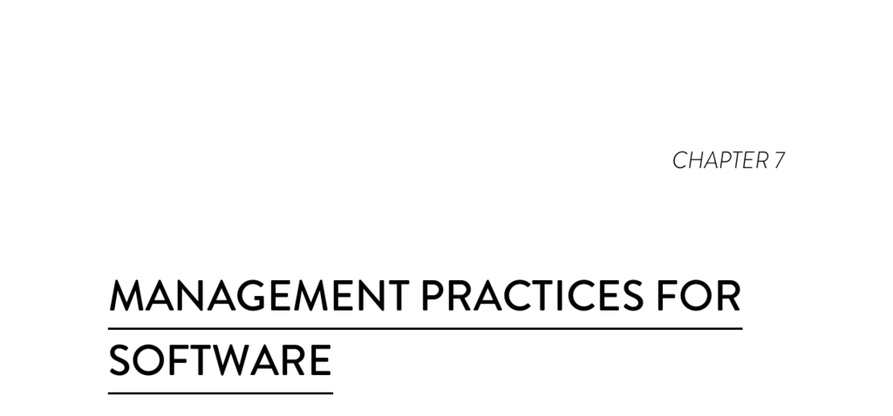

- **Management Practices for Software**
  - **Lean Management Practices**
    - Limiting work in progress (WIP) helps drive process improvement and increase throughput.
    - Visual displays show key quality and productivity metrics, aligning with operational goals and making obstacles to flow visible.
    - Combining WIP limits with visual displays and feedback from production monitoring tools strongly improves software delivery performance.
    - These practices decrease burnout and foster a more generative team culture as described by Westrum’s model.
  - **Implement a Lightweight Change Management Process**
    - Change approval by an external body slows down delivery and does not improve stability metrics like restore time or change fail rate.
    - Peer review or no formal approval process correlates with higher software delivery performance.
    - Lightweight change approval combined with deployment pipelines enables detection and rejection of bad changes.
    - Deployment pipelines provide a complete audit trail linking changes to version control, tests, approvals, and deployments.
    - [Continuous Delivery Deployment Pipeline Patterns](https://continuousdelivery.com/implementing/patterns/) offers further insights.
    - **What About Segregation of Duties?**
      - Segregation of duties can be satisfied within teams via peer review and automated deployments without involving external CABs.
      - Changes should be reviewed by someone other than the author and approved via systems like GitHub pull requests or pipeline manual stages.
      - Changes must be deployed to production only through fully automated deployment pipelines following version control commits and successful validation.
      - Auditors gain comprehensive visibility into change history and approval through deployment pipeline records.
      - Approval by external bodies is ineffective due to the complexity of software systems and the impracticality of accurately reviewing large codebases externally.
      - Governance roles outside teams should focus on monitoring delivery performance and promoting stability and quality improvement practices.
