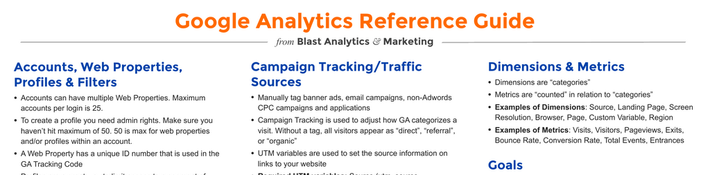

- **Accounts, Web Properties, Profiles & Filters**
  - **Accounts, Web Properties, and Profiles**
    - An account can have multiple web properties, with a login maximum of 25 accounts.
    - There is a limit of 50 web properties and/or profiles within a single account.
    - Profiles require admin rights to create and serve to segment data within a web property.
    - Web properties have unique ID numbers used in the Google Analytics tracking code.
    - [Google Analytics Help](https://support.google.com/analytics/answer/1009618)
  - **Filters**
    - Filters modify how data is processed and stored in profiles and order of filters matters.
    - Filters can include/exclude traffic, rewrite URLs, and adjust case formatting.
    - It is best practice to maintain one unfiltered profile as a backup.
    - Profiles can be duplicated via the "Copy this Profile" link.
    - [Using Filters in GA](https://support.google.com/analytics/answer/1033162)
- **Campaign Tracking/Traffic Sources**
  - **Campaign Tracking**
    - Manually tag campaigns such as banner ads, emails, and non-AdWords CPC for accurate attribution.
    - UTM variables (utm_source, utm_medium, utm_campaign) are required to set source information.
    - Optional UTM variables include utm_term and utm_content for paid search and ad content details.
    - The URL Builder tool can assist in creating properly tagged campaign URLs.
    - [Campaign URL Builder](https://ga-dev-tools.web.app/ga4/campaign-url-builder/)
  - **Cookies**
    - GA uses first-party cookies that are only accessible by the site being visited.
    - Third-party cookies track data across multiple sites but first-party cookies are standard in GA.
    - JavaScript and cookies must not be blocked for user tracking in GA.
    - Temporary cookies clear when users close their browsers.
    - [How Cookies Work in Analytics](https://developers.google.com/analytics/devguides/collection/analyticsjs/cookies-user-id)
  - **Sources & Attribution**
    - Direct traffic occurs when no other source is available such as bookmarks or direct URL entry.
    - GA uses a last non-Direct attribution model, crediting the last non-Direct source for conversions.
    - Adding "utm_nooverride=" preserves the original referring campaign for attribution.
    - Referrers are sites or search engines that linked visitors to your site.
    - [Attribution in Google Analytics](https://support.google.com/analytics/answer/1662518)
- **Goals**
  - **Goal Basics**
    - Goals track “successes” and can only be added by admins.
    - Only one conversion per goal counts per visit, but multiple e-commerce transactions can occur.
    - Goals can track time on site, pages viewed, events, or URL destinations.
    - Site search term reports only show goal conversions for visitors who used site search.
    - Goals have a limit of 20 per profile and are tied specifically to profiles.
    - [Setting up Goals](https://support.google.com/analytics/answer/1012040)
  - **Funnels and Destination Goals**
    - URL Destination goals allow setting up funnels of pages leading to the goal.
    - Funnels help visualize visitor progression through a series of pages toward completion.
    - [Understanding Funnels](https://support.google.com/analytics/answer/2976313)
- **Cross Domain Tracking**
  - GA requires customization to track visits across multiple domains or subdomains.
  - Methods include using _link(), _linkByPost(), _setAllowLinker(), and _setDomainName() functions.
  - Proper cross domain tracking prevents losing referral sources when transitioning domains.
  - [Cross Domain Tracking Guide](https://developers.google.com/analytics/devguides/collection/analyticsjs/cross-domain)
- **Ecommerce Tracking**
  - ecommerce tracking code must be installed on the checkout “Thank you” page.
  - Transaction data is sent via the tracking code to register sales and revenue.
  - Cross domain tracking is necessary for accurate referral sources when traffic comes from multiple domains.
  - Ecommerce revenue data is viewable on reports such as All Traffic via Explorer Tabs.
  - Placeholder empty arguments (“”) should be supplied if unspecified.
  - [Ecommerce Tracking Setup](https://support.google.com/analytics/answer/1037245)
- **Adwords & Analytics**
  - Connecting Adwords and Analytics allows cost data importation and better reporting.
  - Use auto-tagging in Adwords; avoid manual tagging to prevent data conflicts.
  - Adwords shows conversions on ad display date; Analytics shows conversions on conversion date.
  - Adwords filters invalid clicks and distinguishes Google CPC from non-Google CPC visits.
  - Users blocking JavaScript or cookies affect Analytics but not Adwords tracking.
  - [Linking Google Ads and Analytics](https://support.google.com/analytics/answer/1033961)
- **Real-time Report**
  - Displays active visitors and pageviews by second and minute over the last 30 minutes.
  - Can categorize by traffic source, visitor location, and pages viewed.
  - Useful for monitoring current site activity and traffic trends instantly.
  - [Real-Time Reporting](https://support.google.com/analytics/answer/1638635)
- **Virtual Pageviews & Event Tracking**
  - Use _trackPageview to differentiate steps in forms or checkout when URIs are not unique.
  - Use _trackEvent for Flash event tracking with categories, actions, and labels.
  - Virtual pageviews track user actions that do not normally generate pageviews.
  - [Event Tracking Guide](https://developers.google.com/analytics/devguides/collection/analyticsjs/events)
- **Custom Reports**
  - Explorer option shows hierarchical data tables with clickable rows for drill down.
  - Flat Table option shows data in a single, comprehensive table.
  - Custom reports allow tailored data views to meet specific analytics needs.
  - [Creating Custom Reports](https://support.google.com/analytics/answer/1151300)
- **Fundamentals**
  - CTR equals clicks divided by impressions.
  - URI refers to the file path excluding the domain.
  - Bounce rate is the percentage of visitors who view only one page.
  - Crawlers are excluded since they don’t execute JavaScript.
  - Data can take over 24 hours to appear in GA Standard reports.
  - No personal identifiable information (PII) like names or credit cards is stored in GA.
  - [Google Analytics Fundamentals](https://analytics.google.com/analytics/academy/course/6)
- **Intelligence Events**
  - Intelligence events are alerts GA generates upon detecting changes in site performance.
  - Alerts can be configured for email notifications on daily, weekly, or monthly intervals.
  - Both custom and automatic alerts are supported.
  - [Intelligence Events Overview](https://support.google.com/analytics/answer/1681845)
- **Segmentation**
  - Segments filter visits matching specific criteria for focused analysis.
  - Segments can be created using dimensions or metrics.
  - Up to four segments can be applied simultaneously for side-by-side comparison.
  - Segments can also be applied to historical data.
  - [Segments in GA](https://support.google.com/analytics/answer/3123951)
- **Google Analytics RegEx Reference Guide**
  - Anchors (^, $) denote start and end of line matches.
  - Shorthand character classes include \s (whitespace), \d (digit), \w (word), and their opposites.
  - Quantifiers control matching counts: *, +, ?, {X}, {X,Y}, and lazy variants.
  - Ranges use brackets [abc], negation [^abc], and specify character classes.
  - Examples illustrate IP matching, URL path matching, and query string parameter extraction.
  - [RegEx Tutorial](https://www.regular-expressions.info/tutorial.html)
