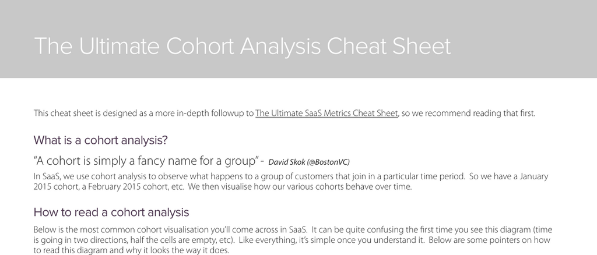

- **What is a cohort analysis?**
  - A cohort is a group of customers who join during a specific time period, such as January 2015 or February 2015.
  - Cohort analysis in SaaS observes the behavior of these groups over time to understand subscription dynamics.
  - David Skok defines a cohort simply as a group, emphasizing the fundamental concept.
  - Further reading: [The Ultimate SaaS Metrics Cheat Sheet](https://blog.chartmogul.com/2015/01/the-ultimate-saas-metrics-cheat-sheet)

- **How to read a cohort analysis**
  - Each row represents a cohort of customers who started paying in a particular month, tracked over time from left to right.
  - Columns indicate months since the cohort joined, starting with column 0 for initial changes in the signup month.
  - Empty cells correspond to future months beyond the current data collection point.
  - Stacking multiple rows highlights evolving patterns in churn or retention across cohorts.
  - Further reading: [Cohort Analysis Visualizations](https://blog.chartmogul.com/2015/01/the-ultimate-saas-metrics-cheat-sheet)

- **Why are cohorts so useful?**
  - Cohort analysis provides a detailed picture of how subscriptions evolve over their lifetime beyond aggregate churn rates.
  - It allows identification of specific periods where churn is highest, enabling targeted customer success actions.
  - Effects of improvements can be observed by comparing cohorts over time.
  - Further reading: [The Ultimate SaaS Metrics Cheat Sheet](https://blog.chartmogul.com/2015/01/the-ultimate-saas-metrics-cheat-sheet)

- **Common uses in SaaS**
  - Churn rate and retention rate are the most frequent metrics analyzed in SaaS cohorts.
  - Cell metrics typically compare to previous months but can also be compared to the original cohort size for alternative insights.
  - Further reading: [SaaS Metrics Guide](https://blog.chartmogul.com/2015/01/the-ultimate-saas-metrics-cheat-sheet)

- **Segmentation, segmentation, segmentation**
  - Segmenting customers is crucial for meaningful cohort analysis and works best with monthly or shorter subscription intervals.
  - Annual subscriptions should not be mixed with monthly cohort analyses.
  - Segmenting by plan and geographical region provides deeper insight into subscription behavior.
  - Further reading: [SaaS Segmentation Techniques](https://blog.chartmogul.com/2015/01/the-ultimate-saas-metrics-cheat-sheet)

- **Other ways to visualise a cohort analysis**
  - Layer Cake visualization shows account value by cohort with examples of negative churn effects.
  - Hanging Ribbons display the percentage of cohort retained over time demonstrating improvement in churn reduction.
  - Visualizations help convey how new cohorts have progressively lower churn at each stage.
  - Credit is given to Tomasz Tunguz for Layer Cake and David Skok for Hanging Ribbons visualizations.
  - Further reading: [Tom Tunguz Blog](https://tomtunguz.com), [David Skok Blog](https://www.forentrepreneurs.com)
