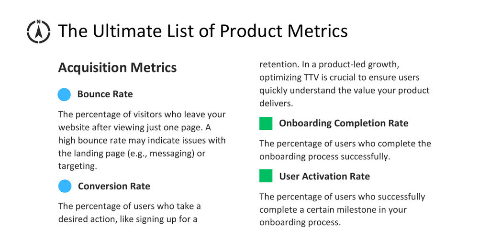

- **Acquisition Metrics**
  - **Bounce Rate**
    - The percentage of visitors who leave the website after viewing only one page.  
    - High bounce rates may indicate issues with landing page messaging or targeting.  
    - Relevant resource: [Bounce Rate Analysis](https://www.digitalmarketer.com/blog/bounce-rate/)  
  - **Conversion Rate**
    - The percentage of users completing desired actions like newsletter sign-ups.  
  - **Landing Page Conversion Rate**
    - The rate of visitors taking specific actions on landing pages, such as starting trials.  
  - **Cost of Customer Acquisition (CAC)**
    - The cost associated with acquiring a new customer through marketing and sales efforts.  
  - **Channel Effectiveness**
    - Measures the success of individual acquisition channels in driving traffic and conversions.  
  - **Traffic Source Distribution**
    - Breakdown of incoming traffic by source, including organic search, paid ads, and referrals.  

- **Activation Metrics**
  - **Time to Value (TTV)**
    - The duration for users to experience core product benefits after initial use.  
    - Shorter TTV improves user satisfaction, engagement, and retention.  
    - Critical in product-led growth strategies.  
  - **Onboarding Completion Rate**
    - The percentage of users who finish the onboarding process successfully.  
  - **User Activation Rate**
    - The portion of users achieving key onboarding milestones.  
  - **Trial-to-Paid Conversion Rate**
    - The percentage of trial users who convert to paying customers.  
  - **First-time User Conversion Rate**
    - Measures first-time users completing desired actions like account creation or purchase.  
    - Indicates onboarding process effectiveness.  

- **Engagement Metrics**
  - **Daily Active Users (DAU)**
    - The count of unique users engaging with the product on a daily basis.  
  - **Monthly Active Users (MAU)**
    - The count of unique users engaging monthly.  
  - **Stickiness**
    - Defined as DAU divided by MAU, indicating user engagement frequency.  
  - **User Satisfaction**
    - Measured through surveys or in-app feedback using scales such as numeric ratings or qualitative terms.  
  - **Session Length**
    - Duration of a user’s interaction during a single session.  
  - **Session Frequency**
    - Average number of sessions per user over a specific timeframe.  
  - **Feature Usage**
    - Frequency and depth of use of individual product features.  
  - **Customer Effort Score (CES)**
    - Measures the ease of user interactions, rated from low to high effort.  
    - Lower scores correlate with increased satisfaction and loyalty.  
  - **Task Success Rate**
    - Percentage of users successfully completing specific tasks.  
    - Assesses feature usability and effectiveness.  
  - **User Feedback Score**
    - Quantitative user satisfaction score gathered via surveys, ratings, or reviews.  

- **Retention Metrics**
  - **Churn Rate**
    - Percentage of users who stop using the product within a defined period (e.g., monthly).  
  - **User Retention Rate**
    - Percentage of users continuing to use the product after a specific timeframe.  
  - **User Renewal Rate**
    - Percentage of users renewing subscriptions after initial contract periods.  
  - **Customer Lifetime**
    - Average duration users remain active before stopping product use.  
    - Calculated as the inverse of churn rate.  
  - **Customer Health Score**
    - A composite metric combining usage, satisfaction, and support data to assess customer relationship quality.  
  - **Product Adoption Rate**
    - Percentage of users adopting new features within a given period after release.  

- **Revenue Metrics**
  - **Average Revenue Per Account (ARPA)**
    - Average revenue generated per customer account over a specific period, such as monthly.  
  - **Customer Lifetime Value (CLV/LTV)**
    - Total revenue generated from a user across their entire relationship.  
    - Calculated as Customer Lifetime multiplied by ARPA.  
  - **Customer Profitability**
    - The difference between lifetime value and customer acquisition cost.  
  - **Monthly Recurring Revenue (MRR)**
    - Predictable monthly revenue from subscription products.  
  - **Expansion Revenue**
    - Additional revenue from existing customers via upsells and cross-sells.  
  - **Revenue Churn**
    - Revenue loss from cancellations, downgrades, or non-renewals within a period.  
  - **Average Contract Value (ACV)**
    - Average revenue per customer contract, useful for evaluating pricing strategies.  

- **Referral Metrics**
  - **Virality Coefficient**
    - Number of new users acquired through referrals relative to existing users.  
  - **Customer Referral Rate**
    - Percentage of customers referring others to the product.  
  - **Referral Conversion Rate**
    - Percentage of referrals converting into active users.  
  - **Net Promoter Score (NPS)**
    - Measures customer loyalty via likelihood to recommend.  
    - Calculated as the percentage of Promoters minus Detractors.  
    - Reflects attitude and sentiment, not actual behavior.  
    - Relevant resource: [NPS Explanation](https://www.netpromoter.com/know/)  

- **Comments**
  - **Cohort Analysis**
    - Comparative analysis of user behavior and retention among groups who started simultaneously.  
    - Useful for tracking trends like monthly retention differences.  
  - **Engagement Metrics in AAARR Framework**
    - Engagement metrics fall under Activation and Retention phases.  
    - Presented separately here to highlight user interaction focus.  
    - Relevant resource: [AAARR Framework](https://www.intercom.com/blog/aaarr-product-metrics/)
