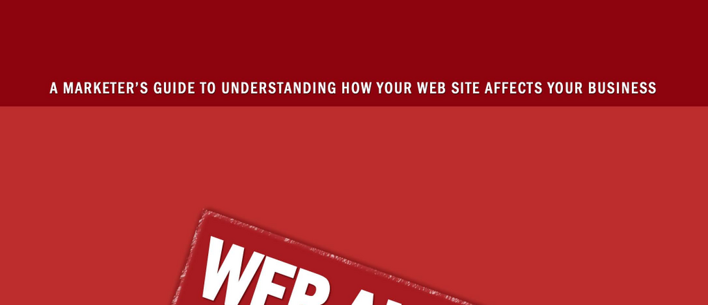

- **Intended Audience for This Book**
  - The book targets professionals needing practical guidance on web analytics.
  - It emphasizes the use of examples and actionable tips throughout.
  - The audience includes those interested in improving website measurement and optimization.
  - Further reading: [Web Analytics 2.0](https://www.oreilly.com/library/view/web-analytics-20/0596101789/)

- **What This Book Is Not**
  - The book does not cover generic marketing topics outside web analytics.
  - It focuses strictly on tools, techniques, and methodologies for web data analysis.
  - It clarifies misconceptions about web analytics capabilities.
  - Further reading: [Avinash Kaushik's Blog](https://www.kaushik.net/avinash/)

- **Use of Examples and Web Analytics Tips throughout This Book**
  - Practical illustrations support conceptual explanations.
  - Tips aim to maximize the effectiveness of web analytics implementations.
  - Examples are drawn from real scenarios to enhance reader comprehension.
  - Further reading: [Occam’s Razor Blog](https://www.kaushik.net/avinash/)

- **What is “Web Analytics”**
  - Web analytics is defined as the measurement, collection, analysis, and reporting of internet data.
  - It involves understanding website usage and user behavior to improve online presence.
  - The discipline combines data from multiple sources for holistic insight.
  - Further reading: [Google Analytics Help Center](https://support.google.com/analytics)

- **Techniques and Technologies Used in Web Analytics**
  - Data sources include web traffic, transactional, and server performance data.
  - Methods incorporate log file analysis, page tagging, and user-submitted information.
  - Technology choices affect data accuracy, speed, and flexibility.
  - Further reading: [Web Analytics Association](https://www.digitalanalyticsassociation.org)

- **Advantages of Web Server Log Files as a Data Source**
  - Log files provide ownership and control over collected data.
  - They offer flexible data collection with diverse data types.
  - Implementation ease is well established with many existing tools.
  - They enable measurement of robots and spider traffic.
  - Further reading: [Managing Large Scale Web Logs](https://www.usenix.org/legacy/event//webmetrics10/tech/final_files/liu_webmetrics2010.pdf)

- **Disadvantages of Web Server Log Files as a Data Source**
  - Proxy and browser caching reduce data completeness.
  - IP addresses do not reliably serve as unique visitor identifiers.
  - Robots and spiders can skew traffic data.
  - Log file analysis suffers from slower report generation and management of multiple files.
  - Further reading: [Server Log Analysis Challenges](https://www.sciencedirect.com/science/article/pii/S0957417413002412)

- **Best Practices When Implementing a Web Server Log File Solution**
  - Careful configuration prevents data integrity and performance issues.
  - Non-human traffic must be excluded for accurate reporting.
  - Planning should address multiple servers, file rotation, and backups.
  - Cache and proxy busting improve data accuracy.
  - Collaboration with application vendors ensures compatibility.
  - Further reading: [Web Log File Analyzer Best Practices](https://www.splunk.com/en_us/form/web-server-log-analysis.html)

- **Examples of When to Use a Web-Server Log-File Application**
  - When historical data integration is required.
  - If web pages cannot be instrumented with scripts.
  - When data ownership and privacy are high priorities.
  - Situations demanding non-intrusive data capture.
  - Further reading: [Log File Analysis in Web Analytics](https://searchdatamanagement.techtarget.com/definition/web-log-file-analysis)

- **Focus on Page Tags as a Data Source**
  - Page tagging collects client-side data via JavaScript.
  - It provides higher data accuracy and faster reporting compared to logs.
  - Tagging allows granular variable collection and detailed visitor identification.
  - Lower upfront costs favor rapid deployments.
  - Further reading: [Understanding Page Tagging](https://developers.google.com/analytics/devguides/collection/analyticsjs)

- **Disadvantages of Page Tags as a Data Source**
  - Dependence on JavaScript and cookies reduces data when disabled or blocked.
  - Implementation complexity increases due to comprehensive tagging.
  - Performance impacts may arise from excessive script execution.
  - Reporting formats can be less flexible.
  - Further reading: [Limitations of JavaScript Tagging](https://www.w3.org/2001/tag/doc/whitepaper.html)

- **Advantages of Page Tags as a Data Source**
  - More accurate data collection due to client-side tracking.
  - Faster data availability for real-time decision making.
  - Greater flexibility in variable definition and data segmentation.
  - Cost-effective implementation compared to log file analysis.
  - Further reading: [Comparison of Tagging vs. Log Files](https://www.digitalanalyticsassociation.org/blog/log-file-vs-tagging-pros-cons)

- **Disadvantages of Page Tags as a Data Source**
  - Susceptible to data loss when JavaScript or cookies are disabled.
  - Tagging every page requires development resources and maintenance.
  - Potential site performance degradation from tags.
  - Limited ability to track bots and spiders accurately.
  - Further reading: [Challenges in Tag-Based Analytics](https://www.cio.com/article/2438283/online-privacy-cookies-and-web-beacons.html)

- **Use of Examples and Web Analytics Tips throughout**
  - The book emphasizes step-by-step real-life examples.
  - Tips are designed to optimize data quality and analysis insights.
  - Examples reinforce concepts like continuous improvement and prioritization.
  - Further reading: [Web Analytics Implementation Guide](https://www.w3.org/TR/analytics/)

- **Where This is Going**
  - Future directions focus on continuous improvement processes.
  - Emphasis on iterative measurement, analysis, prioritization, and verification.
  - Continuous collaboration between business and technical teams is important.
  - Further reading: [Continuous Improvement in Analytics](https://www.sciencedirect.com/science/article/pii/S0263237312000664)

- **The Continuous Improvement Process**
  - The process involves defining goals, measuring outcomes, prioritizing changes, and verifying results.
  - Analysis supports informed decision-making.
  - Systematic application leads to optimization over time.
  - Further reading: [DMAIC Process Overview](https://asq.org/quality-resources/dmaic)

- **Strategies for Success**
  - Focus analysis on micro-level changes rather than broad metrics.
  - Test initiatives over reasonable time frames.
  - Maintain detailed records of what strategies work or fail.
  - Applying continuous improvement principles yields sustainable results.
  - Further reading: [Web Analytics Best Practices](https://privacyinternational.org/long-read/2774/best-practice-web-analytics)

- **Web Analytics Tip: Applying the Continuous Improvement Process**
  - Apply defined measurement frameworks consistently.
  - Use results to adapt and optimize website performance.
  - Engage stakeholders in ongoing evaluation.
  - Further reading: [Kaizen and Continuous Analytics](https://www.kaizen.com/continuous-improvement.html)
