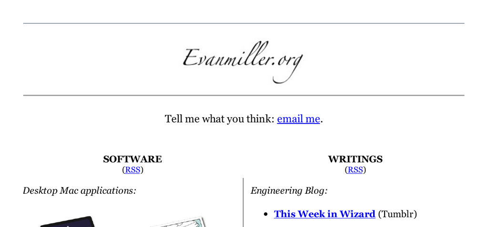

- **Desktop Mac applications**
  - **Wizard**
    - Provides statistical analysis functions tailored for Mac desktop users.
    - Includes tools for A/B testing, sample size calculation, and hypothesis tests.
    - Supports common statistical tests like Chi-Squared, Two-Sample T-Test, and Poisson Means Test.
    - Useful for users requiring rigorous experimental and data analysis.
    - Further reading: [Evan's Awesome A/B Tools](http://www.evanmiller.org/ab-testing.html)

- **For map geeks**
  - **ProjCL**
    - Described as secret map-projection software.
    - Enables advanced geographic map projections for enhanced accuracy.
    - Contributes to improved cartographic and spatial analysis applications.
  - **Google Maps Extension**
    - Allows embedding and editing of Google Maps within wikis.
    - Enhances collaboration on map-based projects.
    - Facilitates ease of use for non-technical contributors.

- **For Erlang developers**
  - **Awesome web framework: Chicago Boss**
    - A web framework for Erlang, similar to Ruby on Rails but claimed to be better.
    - Supports rapid application development in Erlang.
  - **Libraries**
    - Includes BossDB (evented ORM), ErlyDTL (Django template language), Aleppo (Erlang pre-processor), and Jerome (rich-text processing).
    - Libraries offer tools for database management, templating, code processing, and text manipulation.
    - Designed to simplify complex Erlang development tasks.
  - **Erlang references**
    - Tutorials and guides such as "Chicago Boss: A Rough Introduction" and "The Joy of Erlang".
    - Topics cover beginner guides, template compilers, and motivational insights.
    - Designed to support Erlang adoption and proficiency.
    - Further reading: [Chicago Boss](https://github.com/ChicagoBoss/ChicagoBoss)

- **For Nginx administrators**
  - **Nginx modules**
    - Includes mod_circle_gif (serve round corners via URL color specification), mod_zip (on-the-fly ZIP archive assembly), nginx_upstream_hash (hashing load balancer), and mod_rrd_graph (RRDtool graph integration).
    - Modules enhance Nginx with specialized image serving, archive creation, load balancing, and monitoring features.
    - Developed originally for specific use cases such as box.net.
  - **nginx.vim**
    - Syntax highlighting plugin for Vim editor, tailored for Nginx configuration files.
    - Facilitates clearer, error-reducing editing for administrators.
  - **Nginx references**
    - Includes "Emiller's Guide to Nginx Module Development" and its advanced sequel.
    - Documents cover foundational and complex topics for Nginx module creation.
    - Essential for developers extending Nginx functionality.
    - Further reading: [Nginx Module Development](https://www.nginx.com/resources/wiki/modules/)

- **Engineering Blog**
  - **This Week in Wizard (Tumblr)**
    - Offers regular updates and insights related to Wizard, a statistical analyzer.
    - Provides practical tips and commentary on statistical computing.
  - **A/B testing articles**
    - Covers mathematical foundations and practical advice for Bayesian A/B testing.
    - Discusses common pitfalls like low base rates, duration data handling, and lazy assignment.
    - Announces tools designed to improve statistical power and visualization.
    - Shares machine learning applications such as linear regression.
    - Addresses hazards including repeated significance testing.
    - Further reading: [A Formula for Bayesian A/B Testing](https://www.evanmiller.org/bayesian-ab-testing.html)
  - **Applied math**
    - Topics include fire incident analysis comparing Tesla and gasoline fires.
    - Lists statistical formulas useful for programmers.
    - Describes correcting errors in statistical distributions.
    - Explains chart reading and alternative rating approaches.
    - Applies physical laws and forecasting methods to data ranking and monitoring.
  - **Random musings**
    - Explores issues like Apple's RAM performance and startup marketing challenges.
    - Discusses predictive analytics, big data costs, and importance of small data.
    - Offers commentary on math’s role in hacking and software design.
    - Includes thoughts on features in applications and software ratings.
  - **Miscellaneous software notes**
    - Highlights shortcomings in standard math libraries and their impact on developers.
    - Evaluates new programming languages Swift and Julia.
    - Shares personal development experiences for Mac apps.
    - Examines rendering 2D graphics and premature optimization in module development.
  - **Winkel Tripel Warping Trouble**
    - Reports discovery of a bug in the Journal of Surveying Engineering related to map projection.
  - **Why I Program In Erlang**
    - Articulates reasons to adopt Erlang programming language.
    - Suggests benefits and encourages consideration.
    - Further reading: [Why I Program In Erlang](https://www.evanmiller.org/why-i-program-in-erlang.html)
