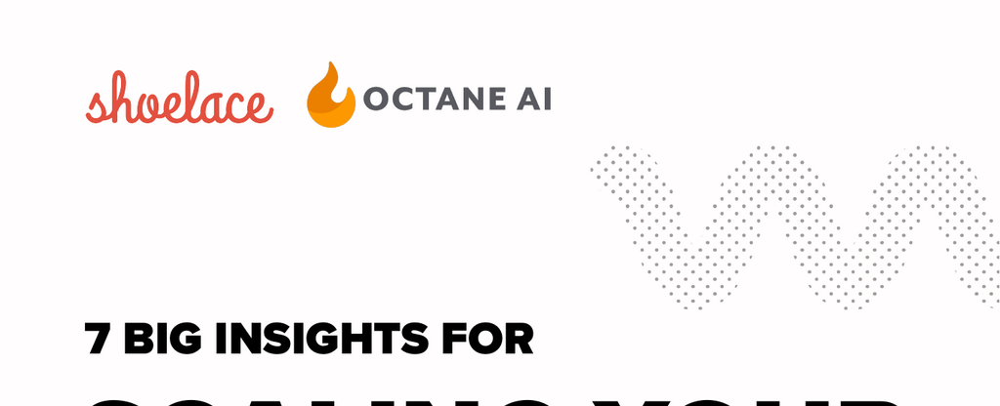

- **Introduction**
  - **Overview of scaling apparel brands**
    - The document shares key insights from running thousands of Facebook and Instagram campaigns for apparel brands.
    - It addresses the challenges of advertising to fickle fashion consumers and the need for constant iteration.
    - Contact information for further inquiries is provided: Elliott from Shoelace.
    - Further reading: [Shoelace Official Website](https://shoelace.com)

- **Paid Advertising**
  - **User Generated Content (UGC) Outperforms Traditional Creatives**
    - UGC ads produce higher Return on Ad Spend (ROAS) compared to traditional, studio-quality ads.
    - Authentic content resembling the target market’s everyday usage drives stronger audience trust and engagement.
    - Younger, casual brands benefit from TikTok and Story-style UGC; luxury brands should use influencers and staged content.
    - Further reading: [CXL on User Generated Content](https://cxl.com/blog/user-generated-content/)
  - **Deeper Thinking About Lookalikes (LLAs) is Necessary for Outstanding Results**
    - Refined LLAs segmented by seasonality and product purchase history improve campaign performance.
    - Smaller but more specific LLAs can yield better ROAS than larger, generic audiences.
    - Testing different LLA percentages based on audience size further optimizes results.
    - Further reading: [Facebook Lookalike Audiences Guide](https://www.facebook.com/business/help/164749007013531)
  - **Instant Experience Ads are an Ideal Ad Type for Apparel Brands**
    - Instant Experience ads provide an immersive, mobile-first shopping experience that outperforms carousel ads.
    - These ads achieve higher ROAS and lower CPAs compared to Dynamic Product Ads in retargeting.
    - Catalog Sales objectives are recommended when setting up Instant Experience ads.
    - Further reading: [Facebook Instant Experience Ads](https://www.facebook.com/business/ads/instant-experience)
  - **AOV is a Critical Metric to Consider for Apparel Brand Ad Strategy**
    - Average Order Value (AOV) should guide both prospecting and retargeting strategies.
    - High repeat customer brands can afford higher acquisition costs on entry products; others should prioritize higher-priced items.
    - Cross-selling complementary products in retargeting campaigns increases overall Customer Lifetime Value (LTV).
    - Further reading: [Shopify on Improving AOV](https://www.shopify.com/enterprise/increase-average-order-value)
  - **Growing your Customer List by Presenting More than One Way for Visitors to Opt-in**
    - Diversifying opt-in touchpoints (pop-ups, comment capture, checkboxes) significantly grows marketing lists.
    - Clients saw an average 700% increase in messenger subscribers and 7–20% revenue increase from opt-in diversification.
    - Multiple opt-in methods improve customer trust and enable sustainable audience growth.
    - Further reading: [Octane AI on List Growth](https://www.octaneai.com/blog/growing-your-messenger-list)
  - **Using Facebook Messenger for Abandoned Cart Followups Outperforms Email**
    - Messenger messages achieve open rates of 80–95%, doubling email performance (41% open rate).
    - Messenger converts approximately 1 in 9 carts without discounts; one apparel brand recovered 7% of abandoned carts.
    - Best practices include conversational buttons, multi-channel opt-ins, product-specific reviews, and coupon codes.
    - Further reading: [Octane AI on Abandoned Cart Funnels](https://www.octaneai.com/blog/abandoned-cart-messenger)
  - **Well-Executed Facebook Messages and Click-to-Messenger Ads Provide High ROAS**
    - Conversational Facebook Messenger ads yield consistent ROAS between 6x and 20x.
    - Direct inbox delivery enables more personal brand engagement than traditional feed ads.
    - Effective campaigns use multiple message flows, lifestyle imagery, direct product links, and authentic reviews.
    - Further reading: [Facebook Click-to-Messenger Ads](https://www.facebook.com/business/help/352555138576628)

- **Advertising | Data Collection**
  - **How Shoelace helps Apparel Merchants**
    - Shoelace ran 8,066 apparel campaigns with an average blended ROAS of 9.88x.
    - The company leverages its apparel experience to optimize audience targeting and ad design.
    - Positive client testimonials highlight revenue growth and audience expansion.
    - Further reading: [Shoelace Apparel Case Studies](https://shoelace.com/case-studies)
  - **How Octane helps Apparel Merchants**
    - Octane AI supports over 1,000 Shopify merchants by increasing marketing opt-ins and automating Messenger and SMS messaging.
    - Client brands have increased monthly revenues by $100,000 to $280,000 using Octane AI’s tools.
    - Octane AI provides demos and case studies for interested apparel brands.
    - Further reading: [Octane AI Success Stories](https://www.octaneai.com/case-studies)
