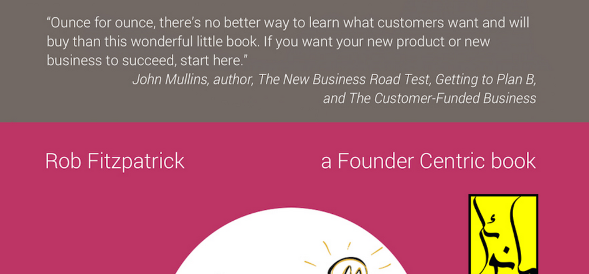

- **Introduction**
  - Customer conversations are compared to delicate archaeological excavations requiring careful questioning.
  - Heavy-handed or overly cautious questioning biases responses and can obscure the truth.
  - Effective customer conversations are essential to discover actionable truths for business success.
  - See also [Lean Startup](https://theleanstartup.com/) for foundational context.

- **Is this book for you?**
  - The book targets individuals uncertain how to start customer conversations in early-stage ventures.
  - It includes traditional businesspeople, mentors, founders validating ideas, and fundraisers seeking evidence.
  - It addresses the difficulties and awkwardness often encountered in customer learning.
  - Refer to [Customer Development](https://steveblank.com/2010/01/25/the-four-steps-to-the-epiphany/) for related methodology.

- **Talking to customers is hard**
  - Many founders talk to customers incorrectly, leading to wasted effort and false validation.
  - False positives in customer conversations cause over-investment risks.
  - The book draws from various methodologies, including Customer Development and Design Thinking.
  - Practical tools cover topics like finding interviewees and taking effective notes.
  - For more insights, consult [User Experience research methods](https://www.nngroup.com/articles/ux-research-cheat-sheet/).

- **Chapter One: The Mom Test**
  - The Mom Test advocates asking questions that avoid bias and lying by framing inquiries around customers' lives.
  - Three core rules: talk about customers' lives, focus on past specifics, and listen more than talk.
  - Good questions avoid opinions, hypotheticals, and direct validation requests.
  - Examples contrast ineffective pitching questions with effective exploratory conversation.
  - Explore [The Mom Test book](https://momtestbook.com/) for a comprehensive guide.

- **Good question / bad question**
  - Lists common questions categorized by whether they pass or fail The Mom Test.
  - Bad questions often solicit opinions, hypotheticals, or future promises prone to false positives.
  - Good questions elicit specific, concrete past behaviors and motivations.
  - Emphasizes importance of avoiding asking customers what to build.
  - See [Avoiding bias in customer interviews](https://hbr.org/2016/03/how-to-conduct-customer-interviews) for strategies.

- **Chapter Two: Avoiding bad data**
  - Identifies three types of bad data: compliments, fluff, and ideas.
  - Compliments often mislead by providing false validation; must be deflected to extract facts.
  - Fluff includes generic, hypothetical, and future-oriented claims; must be anchored to concrete past examples.
  - Feature requests and ideas require digging below the surface to understand motivations before action.
  - Advises against seeking approval or pitching during learning conversations.
  - For further guidance, reference [Steve Blank’s customer discovery](https://steveblank.com/2010/03/02/customer-discovery/).

- **Deflect compliments**
  - Compliments can distort learning and give false positives; avoid accepting them as validation.
  - Best mitigated by focusing questions on customers’ current behaviors and workflows.
  - Recognizes compliments’ pervasiveness and offers examples of deflecting them effectively.
  - Reminds founders to interpret enthusiasm skeptically and extract actionable information.
  - Related reading: [How to read between the lines in customer feedback](https://www.intercom.com/blog/how-to-get-useful-customer-feedback/).

- **Anchor fluff**
  - Generic claims, future promises, and hypothetical responses constitute fluff.
  - Anchoring fluff involves asking for specifics about recent past behavior to obtain reliable data.
  - Illustrates pitfalls of questions like "Would you ever?" and how to transition to factual queries.
  - Demonstrates with examples in user behavior contexts, such as loyalty apps and inbox management.
  - See [Behavioral economics and customer behavior](https://www.behavioraleconomics.com/resources/mini-encyclopedia-of-be/).

- **Dig beneath ideas**
  - Feature requests should be explored to uncover true motivations rather than blindly implemented.
  - Digging questions help identify whether features address critical pain points or superficial desires.
  - Provides a detailed example where misunderstanding customer motivations led to wasted development.
  - Emphasizes probing emotional signals to gain richer customer insights.
  - For deeper techniques, consult [Qualitative research methods](https://www.nngroup.com/articles/qualitative-research/).

- **Stop seeking approval**
  - Seeking approval introduces bias and leads to worthless compliments.
  - Differentiates between intentional fishing for compliments and accidental ego exposure ("Pathos Problem").
  - Advises keeping the conversation centered on the customer rather than the entrepreneur’s idea.
  - Mentions exceptions for famous entrepreneurs who thrive on negative feedback, which is not typical.
  - Additional resource: [Overcoming ego bias in startups](https://firstround.com/review/why-founder-ego-kills-startups/).

- **Cut off pitches**
  - Pitching during learning talks shuts down learning and encourages polite but meaningless responses.
  - Founders should apologize and refocus conversations to avoid alienating customers.
  - Notes that persistence in pitching inappropriately reduces conversation effectiveness.
  - Suggests postponing pitching until after unbiased learning occurs.
  - Reference [Effective customer interviewing vs. pitching](https://hbr.org/2014/10/the-best-way-to-listen-is-to-keep-quiet).

- **Talk less**
  - Emphasizes that founders must listen more and resist interrupting customers.
  - Interruptions often cause loss of valuable context and insights.
  - Advises valuing customer mental models and narratives before providing explanations.
  - Reinforces that increased talking correlates negatively with productive learning.
  - See [Active listening techniques](https://www.mindtools.com/CommSkll/ActiveListening.htm).

- **Chapter Three: Asking important questions**
  - Avoid trivial questions that do not impact business decisions.
  - Identify and confront "world-rocking" questions that could validate or invalidate the business.
  - Advocates thought experiments imagining failure or success to reveal key learning objectives.
  - Encourages including financial and legal queries that founders may avoid due to discomfort.
  - Explore [Thinking like a founder](https://hbr.org/2017/03/how-founders-can-use-design-thinking-to-avoid-failure).

- **Love bad news**
  - Embraces negative or lukewarm customer feedback as vital learning signals.
  - Warns against chasing false positives to avoid costly misdirections.
  - Defines bad news as eliminating wrong paths quickly to conserve resources.
  - Recommends following lukewarm responses with probing questions to understand customer apathy.
  - Consult [Fail fast principles](https://www.inc.com/guides/2010/06/defining-fail-fast.html) for related concepts.

- **Look before you zoom**
  - Warns against prematurely focusing on narrow problems without verifying customer interest.
  - Demonstrates how zooming too soon leads to false validation and wasted effort.
  - Advocates starting broad to confirm problem importance before exploring specific solutions.
  - Includes example conversations distinguishing customers who care from those who don't.
  - Refer to [Problem discovery in Customer Development](https://steveblank.com/2010/03/02/customer-discovery/).

- **Look at the elephant**
  - Stresses addressing all significant risk factors—customer needs, budgets, and product feasibility.
  - Neglecting critical failure points outside the immediate problem impairs business viability.
  - Illustrates an ambiguous conversation where multiple unknowns remain despite learning.
  - Encourages holistic evaluation of market, customer, and product challenges.
  - See [Startup risks and assumptions](https://blog.strategyzer.com/posts/2013/3/6/assumptions-risk-bad-ideas).

